# Bank XYZ — Microservicios y Seguridad en la Nube con Spring Cloud

Implementación de microservicios bancarios utilizando Spring Cloud, con configuración centralizada, service discovery, tolerancia a fallos y autenticación OAuth2.

## Descripción

El proyecto implementa una arquitectura de microservicios para el Banco XYZ compuesta por seis servicios independientes:

- **config-server**: servidor de configuración centralizada para todos los microservicios.
- **eureka-server**: servidor de service discovery donde se registran los microservicios.
- **auth-server**: servidor de autorización OAuth2 que emite tokens JWT.
- **ms-cuentas**: microservicio de cuentas bancarias con tolerancia a fallos y seguridad JWT.
- **ms-transacciones**: microservicio de transacciones bancarias con tolerancia a fallos y seguridad JWT.
- **ms-clientes**: microservicio de clientes bancarios con tolerancia a fallos y seguridad JWT.

---

## Arquitectura

```
[Config Server :8888]
        ↑ configuración centralizada
[Eureka Server :8761]
        ↑ service discovery
[ms-cuentas :8081] [ms-transacciones :8082] [ms-clientes :8083]
        ↑ autenticación JWT
[Auth Server :9000]
```

---

## Estructura del repositorio

```
(completar con estructura actual)
```

---

## Tecnologías

- Java 21
- Spring Boot 3.5.0
- Spring Cloud 2025.0.0
- Spring Security OAuth2 Authorization Server
- Spring Security OAuth2 Resource Server
- Resilience4j (Circuit Breaker, Retry, TimeLimiter, RateLimiter)
- Netflix Eureka
- Spring Cloud Config
- Docker / Docker Compose

---

## Requisitos previos

- Java 21
- Maven
- Docker Desktop
- Postman

---

## Configuración y ejecución

### Opción A — Docker Compose (recomendado)

```bash
# 1. Compilar los JARs de todos los proyectos
cd config-server
./mvnw package -DskipTests
cd ..
cd eureka-server
./mvnw package -DskipTests
cd ..
cd auth-server
./mvnw package -DskipTests
cd ..
cd ms-cuentas
./mvnw package -DskipTests
cd ..
cd ms-transacciones
./mvnw package -DskipTests
cd ..
cd ms-clientes
./mvnw package -DskipTests
cd ..

# 2. Levantar todos los servicios
docker-compose up --build
```

Los servicios quedan disponibles en:

| Servicio | URL |
|---|---|
| Config Server | `http://localhost:8888` |
| Eureka Server | `http://localhost:8761` |
| Auth Server | `http://localhost:9000` |
| ms-cuentas | `http://localhost:8081` |
| ms-transacciones | `http://localhost:8082` |
| ms-clientes | `http://localhost:8083` |

### Opción B — Ejecución local

Levantar en este orden, cada uno en una terminal separada:

```bash
# 1. Config Server
cd config-server
./mvnw spring-boot:run

# 2. Eureka Server
cd eureka-server
./mvnw spring-boot:run

# 3. Auth Server
cd auth-server
./mvnw spring-boot:run

# 4. Microservicios (cada uno en una consola independiente)
cd ms-cuentas
./mvnw spring-boot:run

cd ms-transacciones
./mvnw spring-boot:run

cd ms-clientes
./mvnw spring-boot:run
```

---

## Endpoints disponibles

### Config Server

| Endpoint | Descripción |
|---|---|
| `GET /ms-cuentas/default` | Configuración de ms-cuentas |
| `GET /ms-transacciones/default` | Configuración de ms-transacciones |
| `GET /ms-clientes/default` | Configuración de ms-clientes |

### Auth Server

| Endpoint | Descripción |
|---|---|
| `GET /.well-known/openid-configuration` | Metadata del servidor OAuth2 |
| `POST /oauth2/token` | Obtención de token JWT |

Credenciales del cliente OAuth2:

| Campo | Valor |
|---|---|
| client_id | `bank-xyz-client` |
| client_secret | `secret123` |
| grant_type | `client_credentials` |
| scopes disponibles | `cuentas.read`, `cuentas.write`, `transacciones.read`, `transacciones.write`, `clientes.read`, `clientes.write` |

### ms-cuentas (puerto 8081)

| Endpoint | Método | Acceso | Descripción |
|---|---|---|---|
| `/api/cuentas` | GET | Público | Lista todas las cuentas |
| `/api/cuentas/info` | GET | Público | Info del microservicio |
| `/api/cuentas/resilience` | GET | JWT `cuentas.read` | Lista cuentas con Circuit Breaker + Retry + TimeLimiter |
| `/api/cuentas/ratelimit` | GET | JWT `cuentas.read` | Lista cuentas con Rate Limiter |

### ms-transacciones (puerto 8082)

| Endpoint | Método | Acceso | Descripción |
|---|---|---|---|
| `/api/transacciones` | GET | Público | Lista todas las transacciones |
| `/api/transacciones/info` | GET | Público | Info del microservicio |
| `/api/transacciones/resilience` | GET | JWT `transacciones.read` | Lista transacciones con Circuit Breaker + Retry + TimeLimiter |
| `/api/transacciones/ratelimit` | GET | JWT `transacciones.read` | Lista transacciones con Rate Limiter |

### ms-clientes (puerto 8083)

| Endpoint | Método | Acceso | Descripción |
|---|---|---|---|
| `/api/clientes` | GET | Público | Lista todos los clientes |
| `/api/clientes/info` | GET | Público | Info del microservicio |
| `/api/clientes/resilience` | GET | JWT `clientes.read` | Lista clientes con Circuit Breaker + Retry + TimeLimiter |
| `/api/clientes/ratelimit` | GET | JWT `clientes.read` | Lista clientes con Rate Limiter |

---

## Resilience4j — Patrones implementados

| Patrón | Configuración |
|---|---|
| Circuit Breaker | Se abre con 50% de fallos en ventana de 10 llamadas; espera 10s en estado OPEN |
| Retry | 3 intentos con backoff exponencial (x2) cada 1s |
| Time Limiter | Timeout de 2 segundos por llamada |
| Rate Limiter | Máximo 5 llamadas cada 10 segundos |

---

## Seguridad OAuth2

El flujo de autenticación es `client_credentials` (máquina a máquina):

```
Cliente → POST /oauth2/token → Auth Server → JWT
Cliente → GET /api/.../resilience + Bearer JWT → ms-* → respuesta
```

Las rutas públicas (`/api/cuentas`, `/api/transacciones`, `/api/clientes`) no requieren token. Las rutas de resilience y ratelimit requieren un JWT válido con el scope correspondiente.

---

## Estado actual y proyección

Los microservicios trabajan actualmente con datos de prueba estáticos definidos directamente en los controllers. Esto permite demostrar el funcionamiento de la arquitectura de microservicios, la configuración centralizada, el service discovery y los patrones de seguridad y tolerancia a fallos.

Como proyección, se espera integrar estos microservicios con el sistema existente de `bank-xyz-batch`, consumiendo los datos reales procesados y persistidos en la base de datos MySQL por los jobs de Spring Batch. De esta forma, `ms-cuentas`, `ms-transacciones` y `ms-clientes` expondrían información bancaria real en lugar de datos estáticos, completando así la arquitectura completa del Banco XYZ.

---

## Evidencia de ejecución

Las evidencias se realizan a través de la colección Postman `bank-xyz-s6.postman_collection.json` incluida en `docs/postman/`.

### 1. Servicios levantados con Docker Compose


---

### 2. Config Server — configuración centralizada

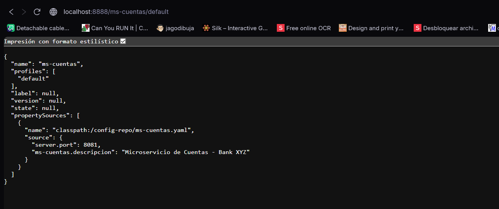
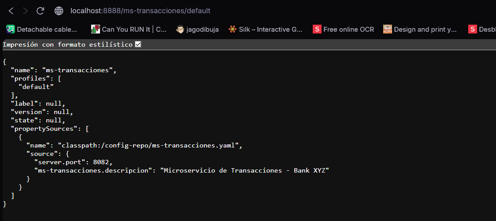
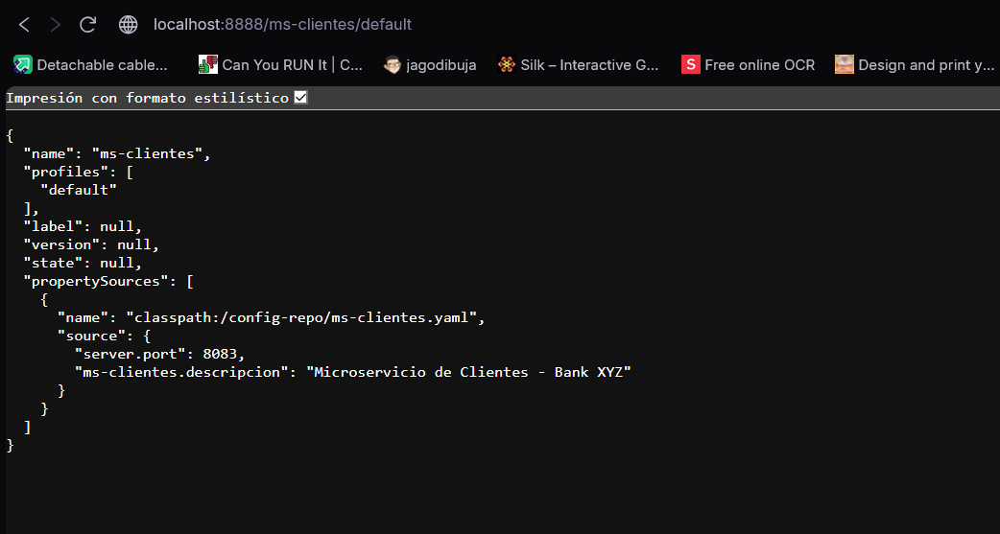

---

### 3. Eureka Server — 3 microservicios registrados

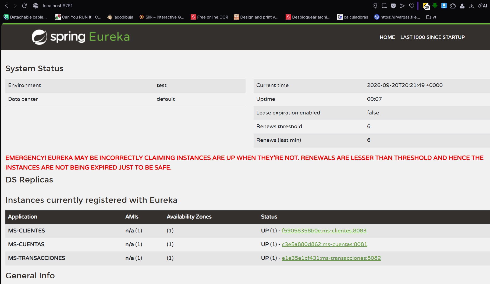

---

### 4. Endpoints públicos

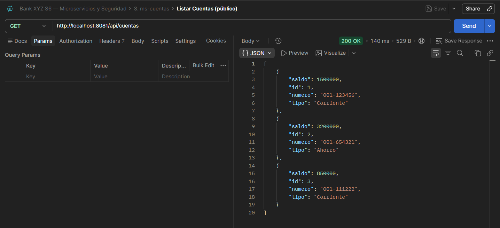
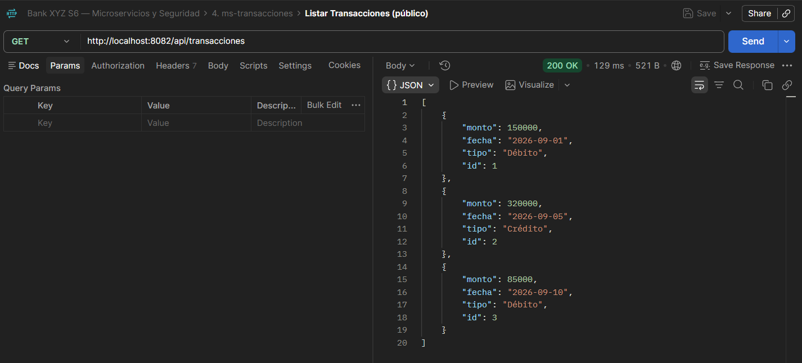
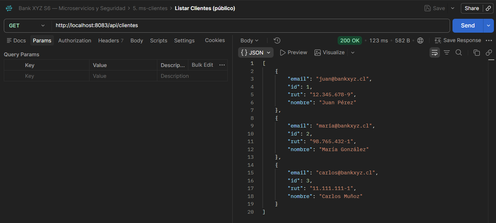

---

### 5. Obtención de token JWT

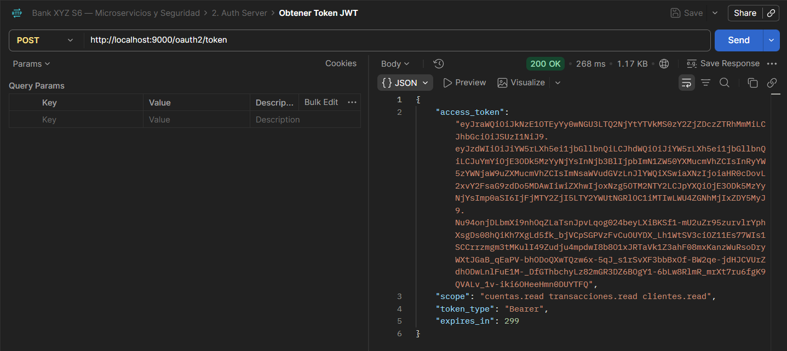

---

### 6. Endpoints protegidos — sin token (401)

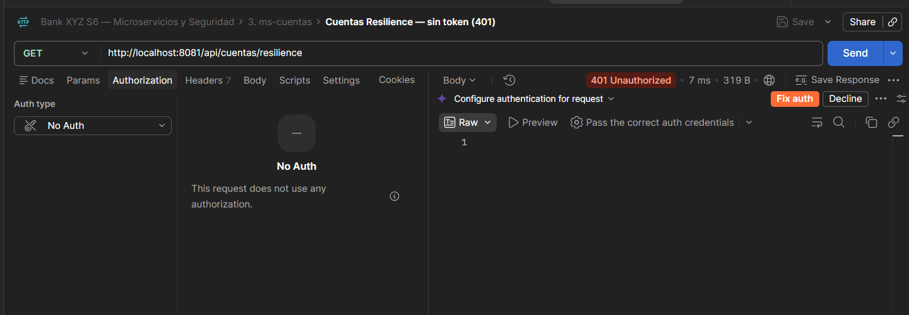
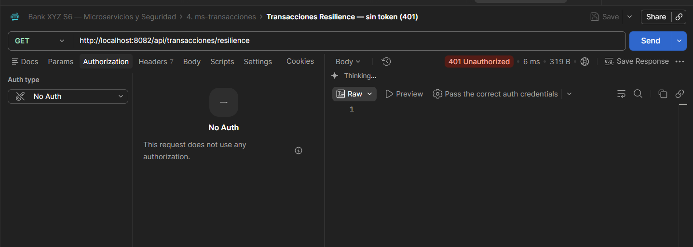
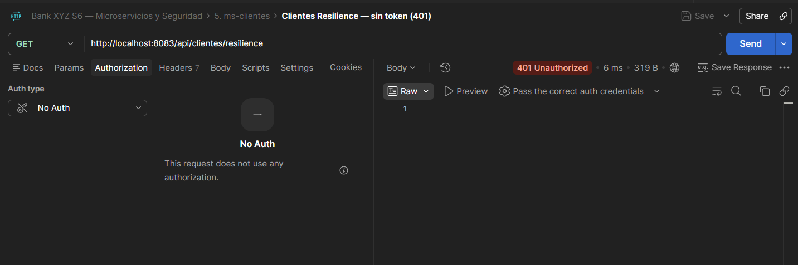

---

### 7. Endpoints protegidos — con token JWT (200)

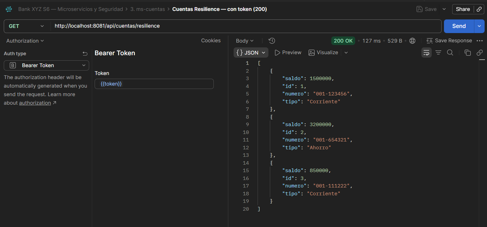
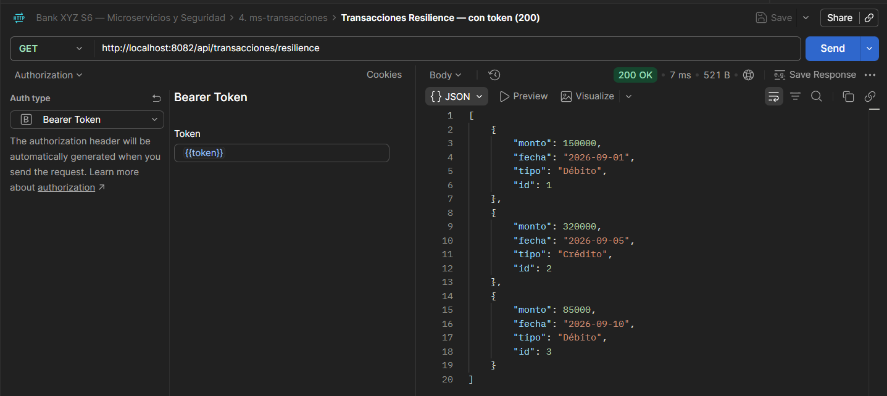
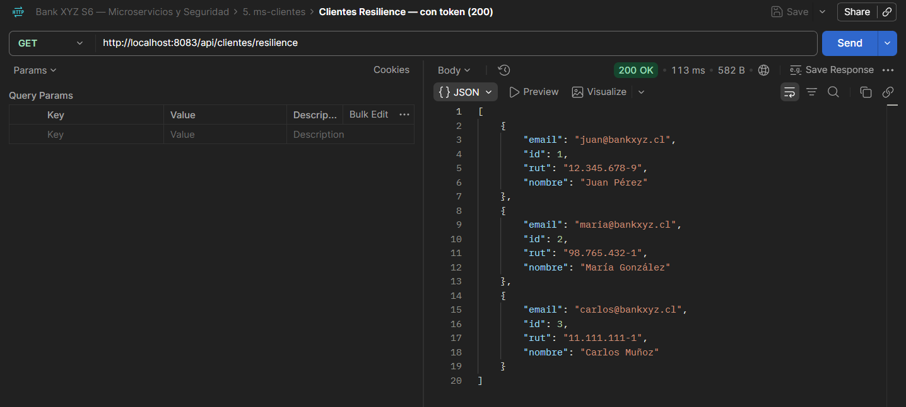
