# Bank XYZ - Spring Batch

Migración de procesos legacy del Banco XYZ utilizando Spring Batch.

## Descripción

Este proyecto implementa la migración de procesos batch del sistema legacy del Banco XYZ, reemplazando scripts COBOL/Shell por soluciones Java modernas utilizando Spring Batch.

Spring Batch es un framework de procesamiento por lotes que permite ejecutar operaciones sobre grandes volúmenes de datos de forma estructurada, confiable y repetible. En este caso, se utiliza para procesar archivos CSV con datos bancarios y persistirlos en una base de datos MySQL, replicando la lógica de negocio que anteriormente ejecutaban los sistemas legacy.

Cada proceso batch está implementado como un Job independiente, lo que permite ejecutarlos de forma aislada según la necesidad operacional del banco.

---

## Arquitectura

El proyecto sigue la arquitectura estándar de Spring Batch, donde cada Job está compuesto por uno o más Steps que encadenan tres componentes principales:

- **ItemReader:** Lee los datos desde un archivo CSV línea por línea y los convierte en objetos Java. Se utiliza `FlatFileItemReader` configurado con el delimitador y los nombres de columna correspondientes a cada archivo. En contextos multi-thread, el reader está envuelto en un `SynchronizedItemStreamReader` para garantizar thread-safety.

- **ItemProcessor:** Recibe cada objeto del Reader, aplica la lógica de negocio (validaciones, transformaciones o cálculos) y retorna el objeto procesado. Si detecta un dato inválido, lanza una `InvalidBankDataException` que es capturada por la `BankSkipPolicy`, permitiendo omitir el registro sin interrumpir el Job.

- **ItemWriter:** Recibe los objetos procesados y los persiste en MySQL mediante `JdbcBatchItemWriter`, ejecutando el INSERT correspondiente a cada tabla.

El flujo de datos es el siguiente:
```
CSV → ItemReader → ItemProcessor → ItemWriter → MySQL
                                       ↓
                               ResumenWriter → MySQL (tablas de resumen)
```

Los Jobs de transacciones diarias y estados de cuenta anuales incorporan un segundo Step que consolida los datos procesados en tablas de resumen independientes.

Los Jobs se lanzan de forma manual a través de endpoints REST expuestos por el `JobController`, lo que permite ejecutar cada proceso de forma independiente y controlada, con parámetros opcionales de configuración (`threads`, `chunkSize`).

---

## Jobs implementados

### dailyTransactionReportJob

Procesa el archivo `transacciones.csv` en dos Steps encadenados. El Processor valida que el monto de cada transacción sea mayor a cero y que el tipo sea `credito` o `debito`, lanzando `InvalidBankDataException` para los registros que no cumplen. Las transacciones válidas se persisten en `transaccion_reporte`. Un segundo Step genera un resumen consolidado con el total de transacciones procesadas, monto total y cantidad de anomalías detectadas, persistido en `transaccion_resumen`.

| Componente | Clase | Descripción |
|------------|-------|-------------|
| Reader | `FlatFileItemReader` | Lee `transacciones.csv` |
| Processor | `TransaccionProcessor` | Valida monto y tipo de transacción |
| Writer (Step 1) | `JdbcBatchItemWriter` | Inserta en `transaccion_reporte` |
| Writer (Step 2) | `TransaccionResumenWriter` | Consolida resumen en `transaccion_resumen` |

---

### monthlyInterestJob

Procesa el archivo `intereses.csv` que contiene las cuentas bancarias con sus saldos y tipos. El Processor aplica una tasa de interés según el tipo de cuenta (`ahorro` 3%, `prestamo` 7%, `hipoteca` 5%), calcula el interés generado y el saldo final. Las cuentas con saldo nulo, cero o negativo, y las de tipo desconocido (`-1`, `unknown`) son descartadas mediante `InvalidBankDataException`. Los resultados se persisten en la tabla `interes_reporte`.

| Componente | Clase | Descripción |
|------------|-------|-------------|
| Reader | `FlatFileItemReader` | Lee `intereses.csv` |
| Processor | `InteresProcessor` | Calcula interés según tipo de cuenta |
| Writer | `JdbcBatchItemWriter` | Inserta en `interes_reporte` |

---

### annualStatementJob

Procesa el archivo `cuentas_anuales.csv` en dos Steps encadenados. El Processor descarta movimientos con monto nulo, cero o negativo, y aquellos con tipo de transacción inválido (distinto de `deposito`, `retiro`, `compra` o `pago`). Los movimientos válidos se persisten en `cuenta_anual_reporte`. Un segundo Step consolida los movimientos por `cuenta_id` en `cuenta_anual_resumen` para uso en auditorías.

| Componente | Clase | Descripción |
|------------|-------|-------------|
| Reader | `FlatFileItemReader` | Lee `cuentas_anuales.csv` |
| Processor | `CuentaAnualProcessor` | Valida monto y tipo de movimiento |
| Writer (Step 1) | `JdbcBatchItemWriter` | Inserta en `cuenta_anual_reporte` |
| Writer (Step 2) | `CuentaAnualResumenWriter` | Consolida resumen en `cuenta_anual_resumen` |

---

## Tecnologías

- Java 21
- Spring Boot 3.3.5
- Spring Batch 5.1.2
- MySQL 8.0
- Docker / Docker Compose
- Lombok

## Requisitos previos

- Java 21
- Maven
- Docker Desktop

## Configuración y ejecución

### 1. Levantar la base de datos

```bash
docker-compose up -d
```

### 2. Compilar el proyecto

```bash
./mvnw clean install -DskipTests
```

### 3. Ejecutar la aplicación

```bash
./mvnw spring-boot:run
```

### 4. Ejecutar los jobs

Los Jobs aceptan parámetros opcionales `threads` y `chunkSize` para controlar el nivel de paralelismo. Si no se especifican, se usan los valores definidos en `application.properties`.

```bash
# Job 1 - Reporte de transacciones diarias
Invoke-RestMethod -Method POST -Uri "http://localhost:8080/jobs/daily-transaction"

# Job 2 - Cálculo de intereses mensuales
Invoke-RestMethod -Method POST -Uri "http://localhost:8080/jobs/monthly-interest"

# Job 3 - Estado de cuentas anuales
Invoke-RestMethod -Method POST -Uri "http://localhost:8080/jobs/annual-statement"

# Con parámetros personalizados
Invoke-RestMethod -Method POST -Uri "http://localhost:8080/jobs/daily-transaction?threads=4&chunkSize=10"
```

## Estructura del proyecto

```
├── .mvn
│   └── wrapper
│       └── maven-wrapper.properties
├── docs
│   └── images
├── src
│   ├── main
│   │   ├── java
│   │   │   └── com
│   │   │       └── duoc
│   │   │           └── bank_xyz
│   │   │               ├── config
│   │   │               │   ├── AnnualStatementJobConfig.java
│   │   │               │   ├── DailyTransactionJobConfig.java
│   │   │               │   └── MonthlyInterestJobConfig.java
│   │   │               ├── controller
│   │   │               │   └── JobController.java
│   │   │               ├── exception
│   │   │               │   └── InvalidBankDataException.java
│   │   │               ├── listener
│   │   │               │   ├── BankSkipListener.java
│   │   │               │   └── JobCompletionListener.java
│   │   │               ├── model
│   │   │               │   ├── CuentaAnual.java
│   │   │               │   ├── CuentaAnualResumen.java
│   │   │               │   ├── Interes.java
│   │   │               │   ├── Transaccion.java
│   │   │               │   └── TransaccionResumen.java
│   │   │               ├── policy
│   │   │               │   └── BankSkipPolicy.java
│   │   │               ├── processor
│   │   │               │   ├── CuentaAnualProcessor.java
│   │   │               │   ├── InteresProcessor.java
│   │   │               │   └── TransaccionProcessor.java
│   │   │               ├── writer
│   │   │               │   ├── CuentaAnualResumenWriter.java
│   │   │               │   └── TransaccionResumenWriter.java
│   │   │               └── BankXyzApplication.java
│   │   └── resources
│   │       ├── static
│   │       ├── templates
│   │       ├── application.properties
│   │       ├── cuentas_anuales.csv
│   │       ├── intereses.csv
│   │       ├── schema.sql
│   │       └── transacciones.csv
│   └── test
│       └── java
│           └── com
│               └── duoc
│                   └── bank_xyz
│                       └── BankXyzApplicationTests.java
├── .gitattributes
├── .gitignore
├── README.md
├── docker-compose.yml
├── mvnw
├── mvnw.cmd
└── pom.xml
```

---

## Manejo de errores y tolerancia a fallos

### InvalidBankDataException

Excepción personalizada lanzada por los Processors cuando detectan un dato inválido. Al lanzar una excepción en lugar de retornar `null`, el registro es capturado por la `BankSkipPolicy` y registrado por el `BankSkipListener`, otorgando trazabilidad completa sobre los datos descartados.

| Job | Caso | Acción |
|-----|------|--------|
| `dailyTransactionReportJob` | Monto nulo, negativo o cero | Lanza `InvalidBankDataException` |
| `dailyTransactionReportJob` | Tipo distinto de `credito`/`debito` | Lanza `InvalidBankDataException` |
| `monthlyInterestJob` | Saldo nulo, negativo o cero | Lanza `InvalidBankDataException` |
| `monthlyInterestJob` | Tipo de cuenta `-1` o `unknown` | Lanza `InvalidBankDataException` |
| `annualStatementJob` | Monto nulo, negativo o cero | Lanza `InvalidBankDataException` |
| `annualStatementJob` | Tipo de movimiento inválido | Lanza `InvalidBankDataException` |

### BankSkipPolicy

Política de omisión personalizada que intercepta las siguientes excepciones y permite continuar el Job sin interrumpirlo:

| Excepción | Origen |
|---|---|
| `FlatFileParseException` | Error de lectura o formato inválido en el CSV |
| `InvalidBankDataException` | Dato de negocio inválido detectado por el Processor |
| `IllegalArgumentException` | Argumento inválido en tiempo de ejecución |
| `DataIntegrityViolationException` | Error de integridad al escribir en la base de datos |

### RetryPolicy y BackOffPolicy

Cada Step está configurado con una `RetryPolicy` que reintenta hasta 3 veces ante errores transitorios, combinada con una `ExponentialBackOffPolicy` con intervalo inicial de 100ms y multiplicador 2 (100ms → 200ms → 400ms entre reintentos), reduciendo la presión sobre recursos compartidos durante fallos temporales.

| Política | Configuración |
|---|---|
| Reintentos máximos | 3 |
| Intervalo inicial | 100ms |
| Multiplicador | 2x (exponencial) |

### Listeners

| Listener | Clase | Función |
|---|---|---|
| Job | `JobCompletionListener` | Loguea nombre, estado y duración de cada Job |
| Skip | `BankSkipListener` | Loguea registros omitidos en lectura, proceso y escritura |

---

## Escalado y optimización (Semana 3)

### Procesamiento multi-thread configurable

Cada Job cuenta con un `ThreadPoolTaskExecutor` configurable mediante parámetros HTTP (`threads`, `chunkSize`), permitiendo ajustar el nivel de paralelismo en tiempo de ejecución sin necesidad de recompilar. Los valores por defecto se definen en `application.properties`.

```properties
batch.thread-pool-size=3
batch.chunk-size=10
```

Para garantizar thread-safety en la lectura concurrente, el `FlatFileItemReader` de cada Job está envuelto en un `SynchronizedItemStreamReader`.

---

## Tests

El proyecto incluye un test de contexto (`contextLoads`) que verifica que la aplicación levanta correctamente con todos sus beans y configuraciones.

Para evitar dependencia de una base de datos MySQL en ejecución durante los tests, se utiliza H2 como base de datos en memoria. Esto se logra mediante `@TestPropertySource` que sobreescribe las propiedades de conexión definidas en `application.properties` únicamente durante la ejecución de los tests, sin modificar la configuración de producción.

```bash
./mvnw clean test
```

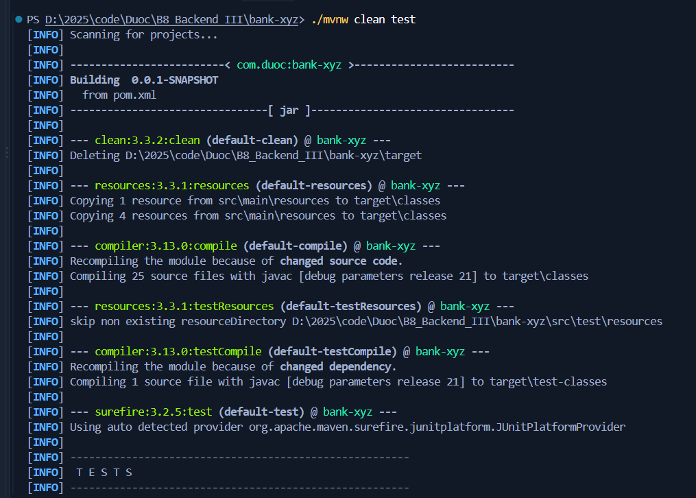
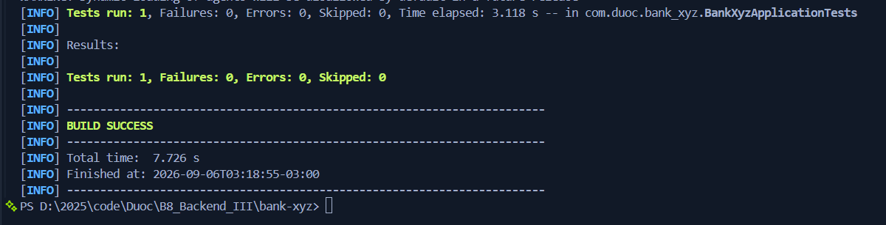

---

## Evidencia de ejecución

### 1. Levantar base de datos

```bash
docker-compose up -d
```

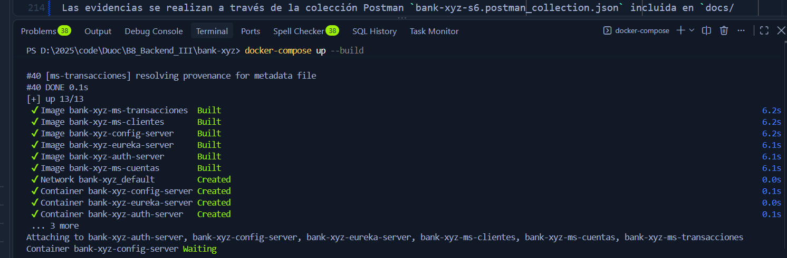

---

### 2. Iniciar aplicación

```bash
./mvnw spring-boot:run
```

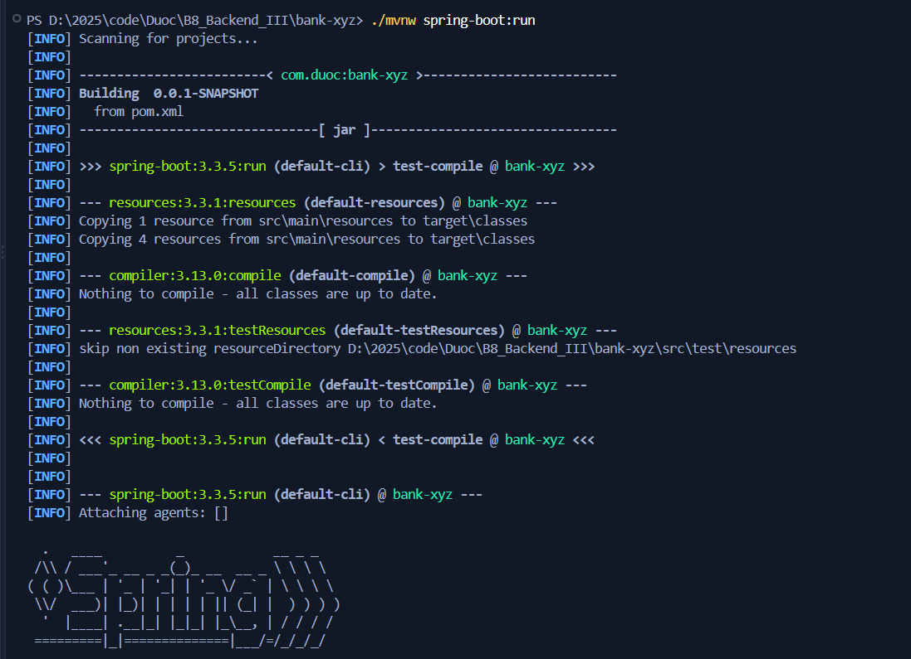
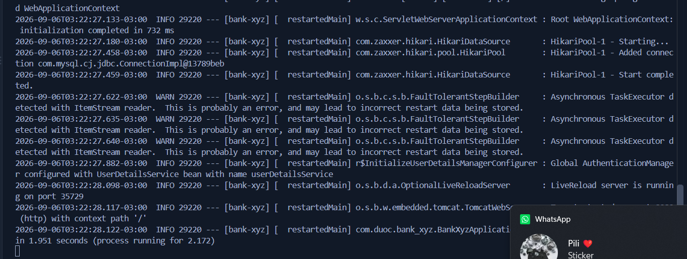

---

### 3. Job 1 - Reporte de transacciones diarias

```bash
Invoke-RestMethod -Method POST -Uri "http://localhost:8080/jobs/daily-transaction?threads=4&chunkSize=10"
```

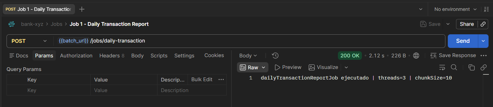
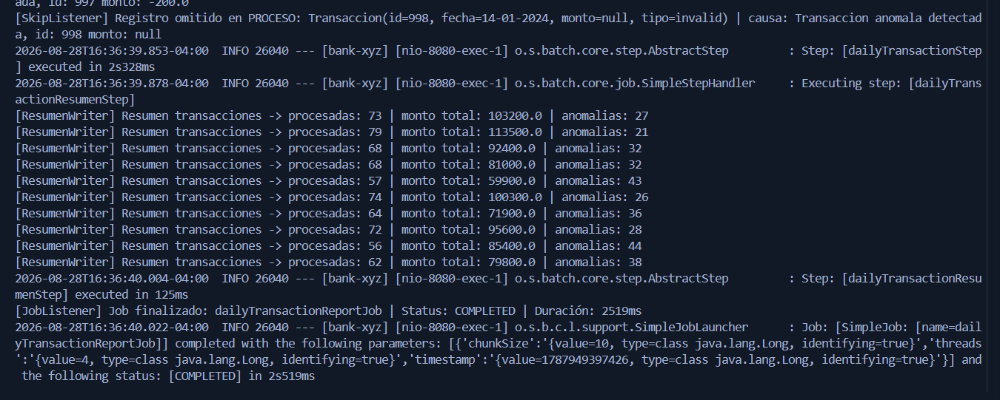

```bash
docker exec -it bank-xyz-mysql mysql -uroot -proot bank_xyz -e "SELECT * FROM transaccion_reporte LIMIT 20;"
docker exec -it bank-xyz-mysql mysql -uroot -proot bank_xyz -e "SELECT * FROM transaccion_resumen;"
```

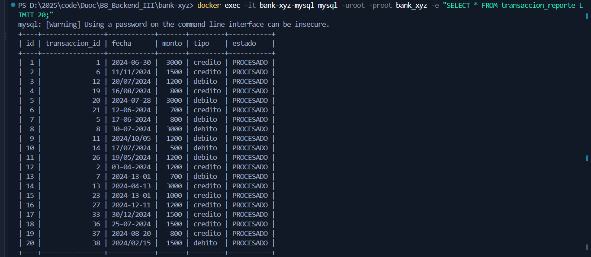
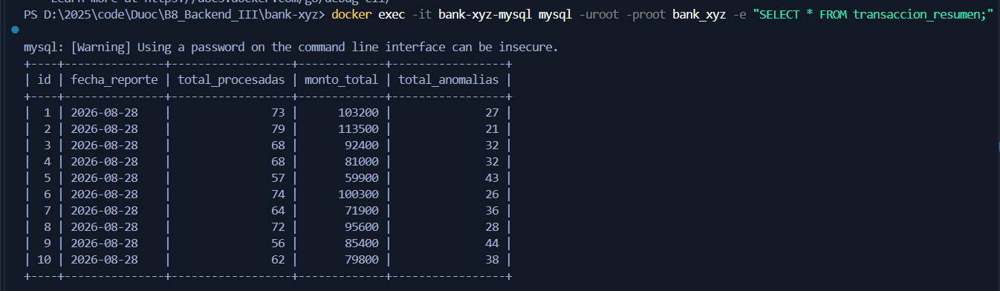

---

### 4. Job 2 - Cálculo de intereses mensuales

```bash
Invoke-RestMethod -Method POST -Uri "http://localhost:8080/jobs/monthly-interest?threads=4&chunkSize=10"
```

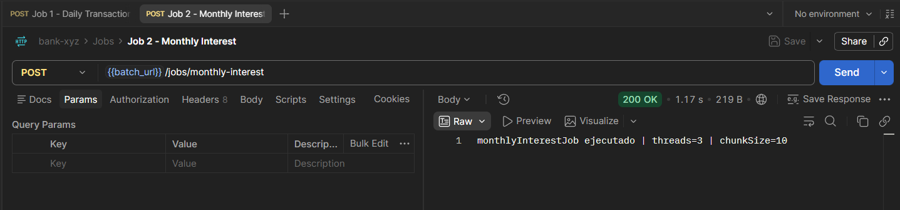
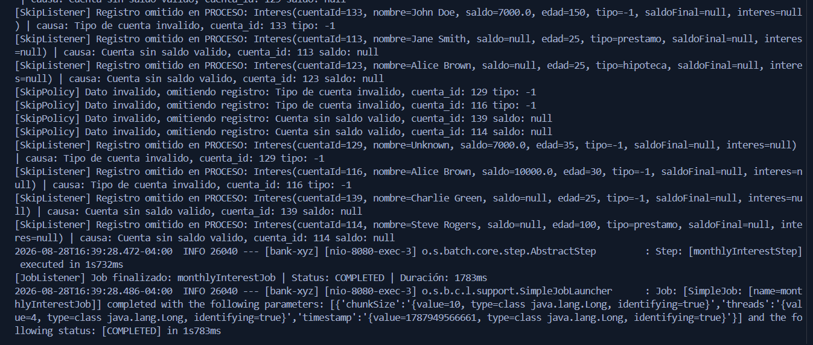

```bash
docker exec -it bank-xyz-mysql mysql -uroot -proot bank_xyz -e "SELECT * FROM interes_reporte LIMIT 20;"
```

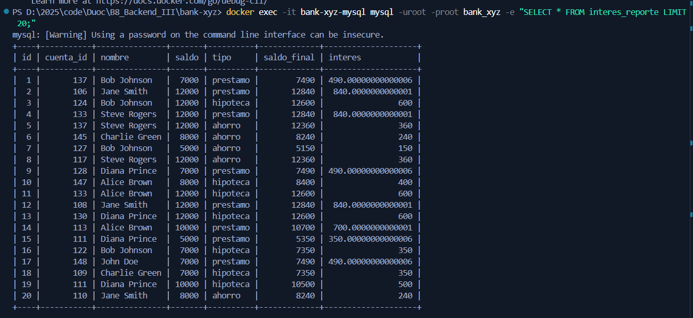

---

### 5. Job 3 - Estado de cuentas anuales

```bash
Invoke-RestMethod -Method POST -Uri "http://localhost:8080/jobs/annual-statement?threads=4&chunkSize=10"
```

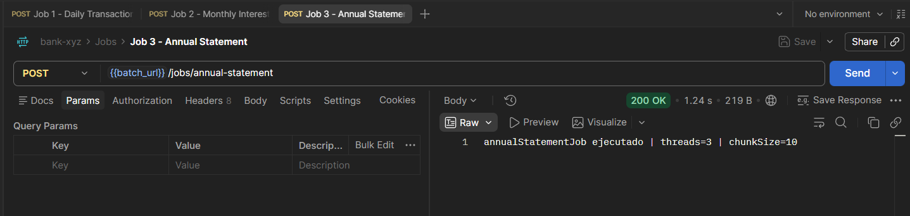
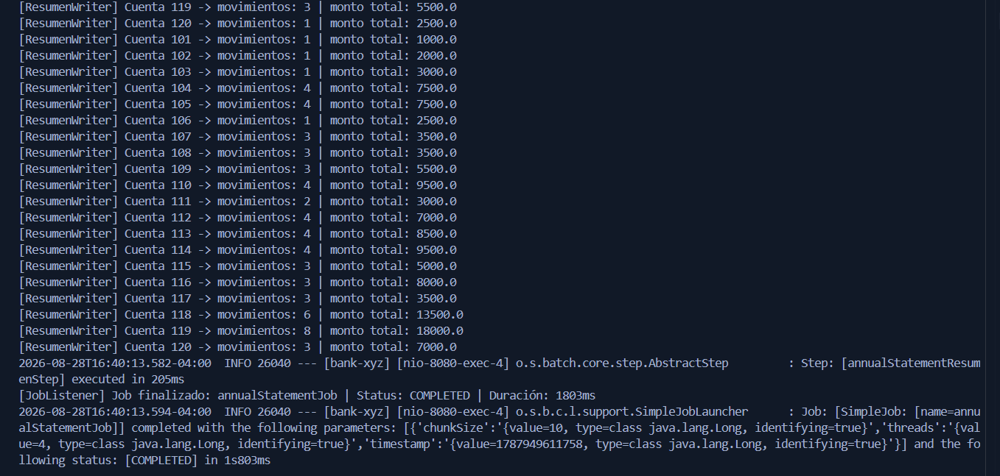

```bash
docker exec -it bank-xyz-mysql mysql -uroot -proot bank_xyz -e "SELECT * FROM cuenta_anual_reporte LIMIT 20;"
docker exec -it bank-xyz-mysql mysql -uroot -proot bank_xyz -e "SELECT * FROM cuenta_anual_resumen;"
```

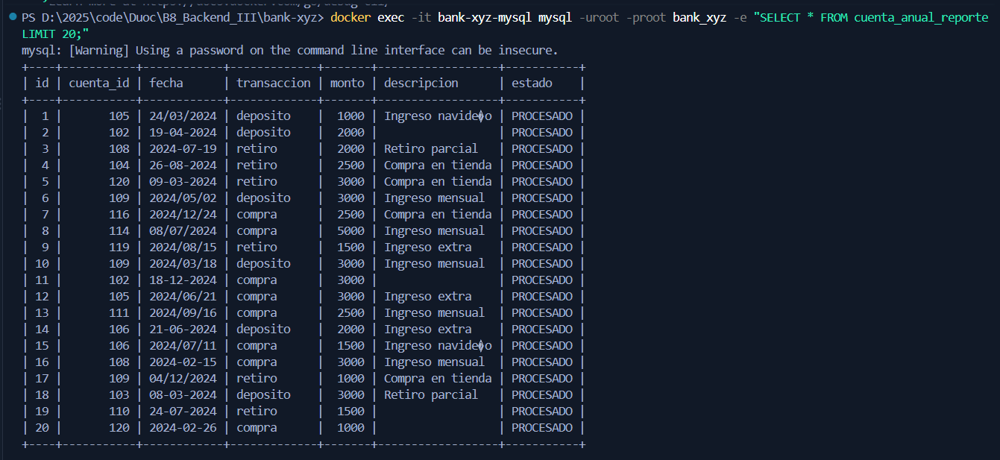
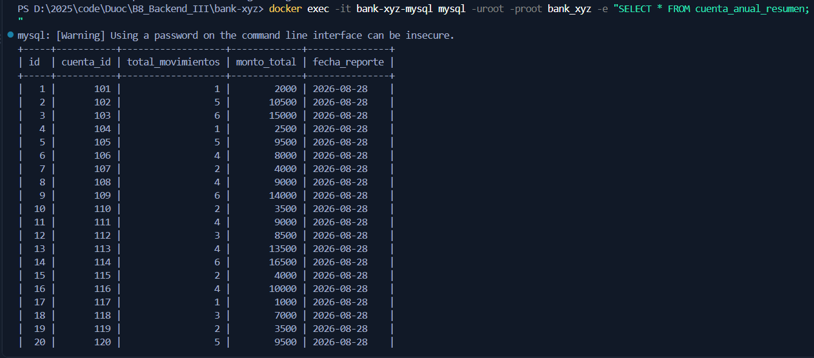

---

### 6. Comparación de rendimiento — escalado multi-thread

Se ejecutó el `dailyTransactionReportJob` tres veces variando el número de hilos, limpiando las tablas entre cada corrida, con el fin de identificar la configuración óptima.

**Corrida 1 — 2 hilos**

```bash
docker exec -it bank-xyz-mysql mysql -uroot -proot bank_xyz -e "TRUNCATE TABLE transaccion_reporte; TRUNCATE TABLE transaccion_resumen;"
Invoke-RestMethod -Method POST -Uri "http://localhost:8080/jobs/daily-transaction?threads=2&chunkSize=10"
```

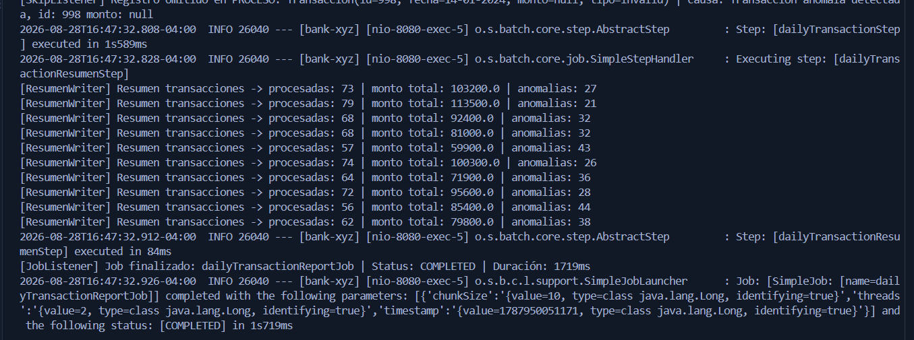

**Corrida 2 — 3 hilos**

```bash
docker exec -it bank-xyz-mysql mysql -uroot -proot bank_xyz -e "TRUNCATE TABLE transaccion_reporte; TRUNCATE TABLE transaccion_resumen;"
Invoke-RestMethod -Method POST -Uri "http://localhost:8080/jobs/daily-transaction?threads=3&chunkSize=10"
```

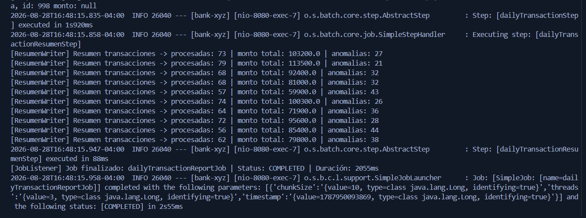

**Corrida 3 — 4 hilos**

```bash
docker exec -it bank-xyz-mysql mysql -uroot -proot bank_xyz -e "TRUNCATE TABLE transaccion_reporte; TRUNCATE TABLE transaccion_resumen;"
Invoke-RestMethod -Method POST -Uri "http://localhost:8080/jobs/daily-transaction?threads=4&chunkSize=10"
```

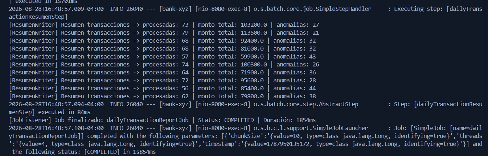

**Resultados**

| Corrida | Threads | Chunk size | Duración |
|---|---|---|---|
| 1 | 2 | 10 | 1s719ms |
| 2 | 3 | 10 | 2s55ms |
| 3 | 4 | 10 | 1s854ms |

---
