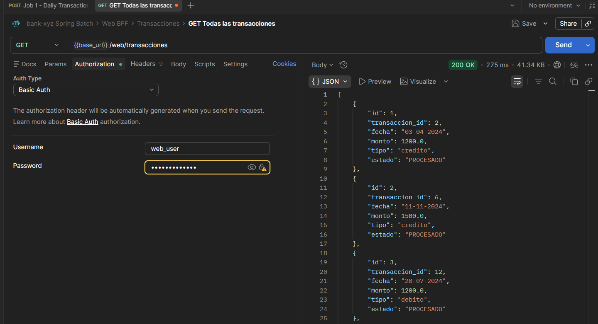
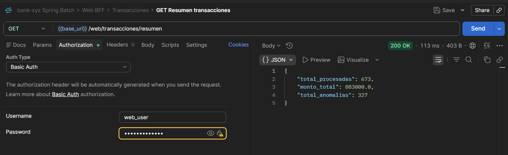
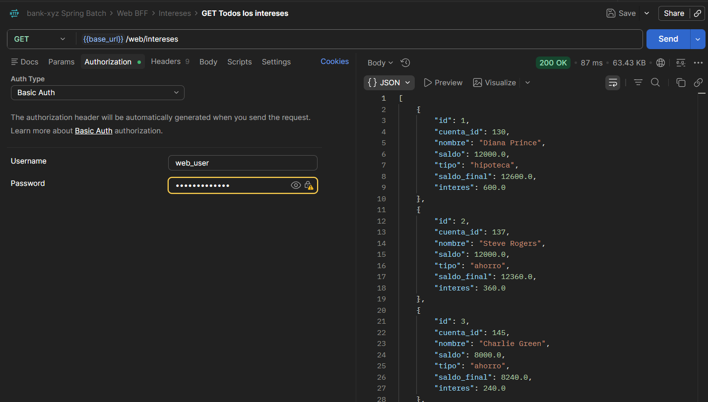
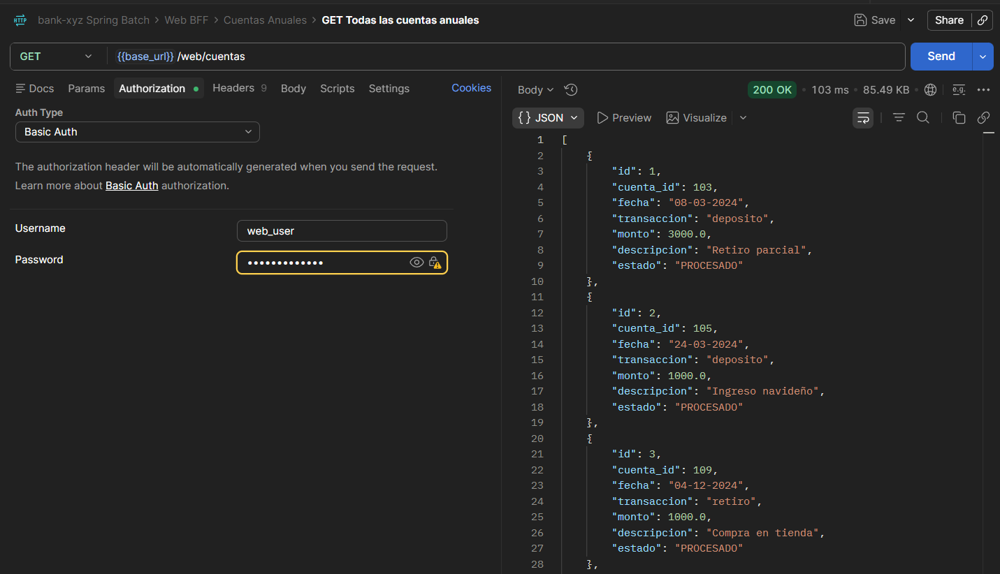
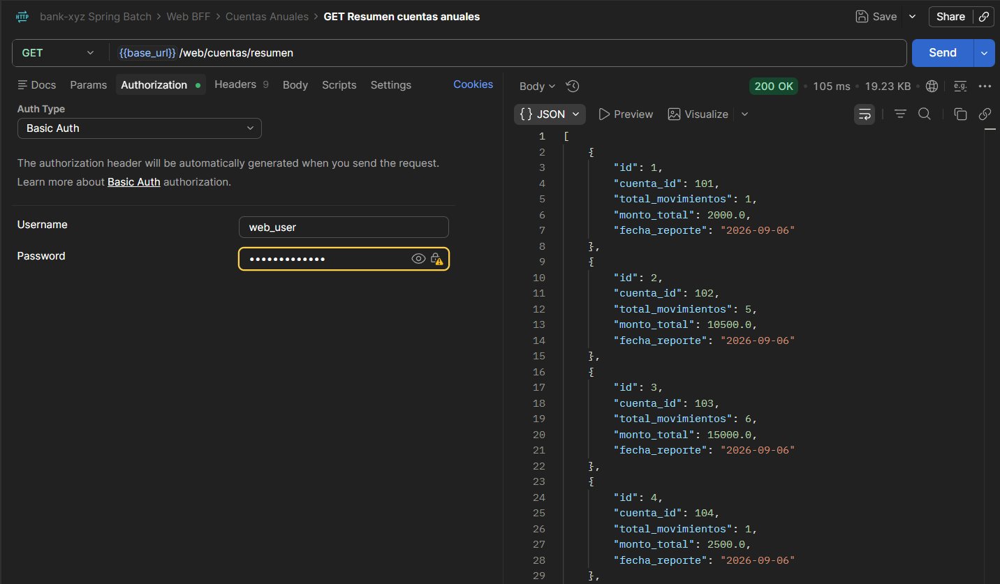
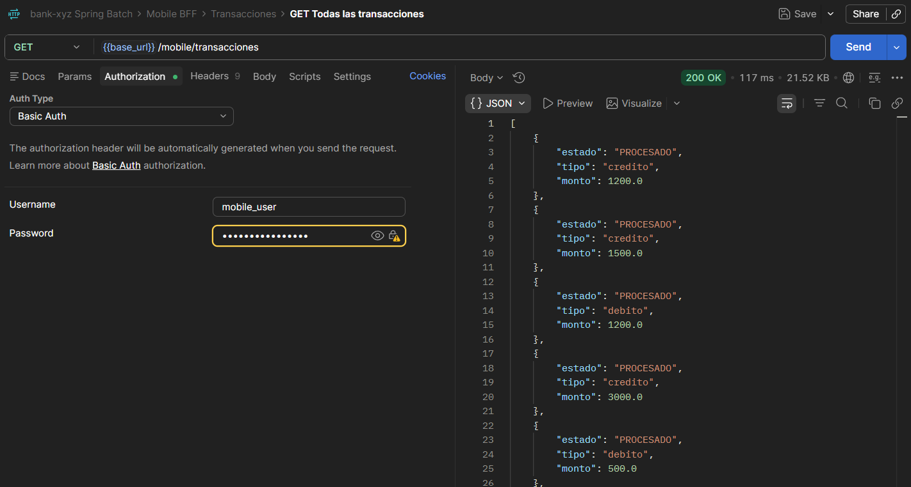
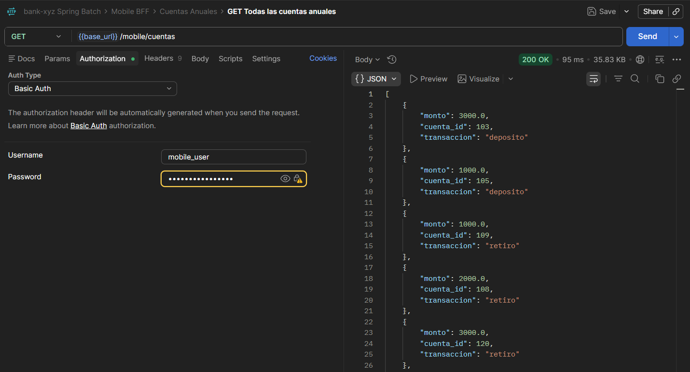
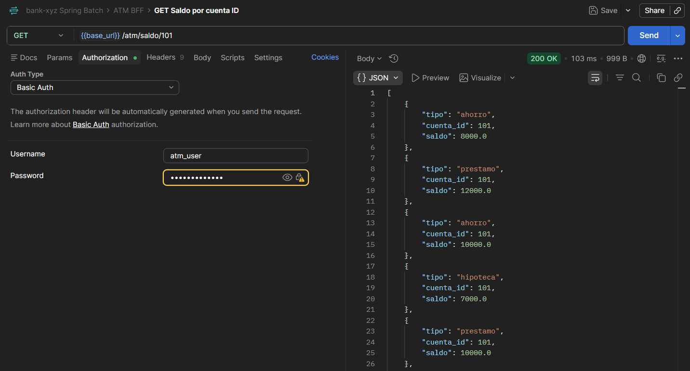
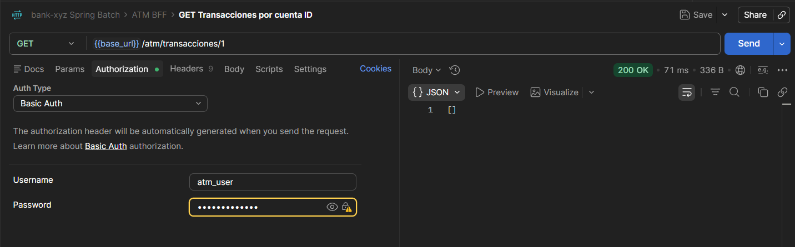
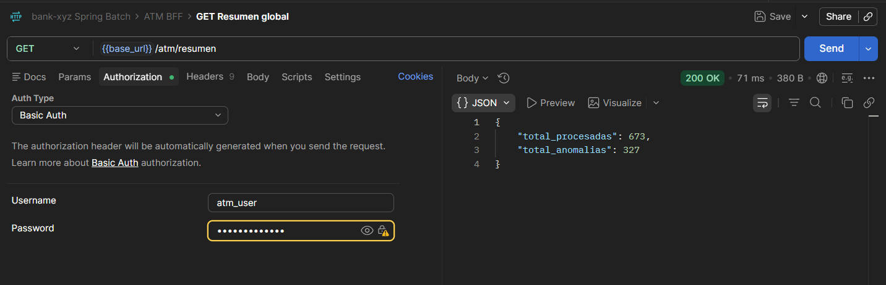

# Bank XYZ - Spring Batch

Migración de procesos legacy del Banco XYZ utilizando Spring Batch.

## Descripción

Este proyecto implementa la migración de procesos batch del sistema legacy del Banco XYZ, reemplazando scripts COBOL/Shell por soluciones Java modernas utilizando Spring Batch.

Spring Batch es un framework de procesamiento por lotes que permite ejecutar operaciones sobre grandes volúmenes de datos de forma estructurada, confiable y repetible. En este caso, se utiliza para procesar archivos CSV con datos bancarios y persistirlos en una base de datos MySQL, replicando la lógica de negocio que anteriormente ejecutaban los sistemas legacy.

Cada proceso batch está implementado como un Job independiente, lo que permite ejecutarlos de forma aislada según la necesidad operacional del banco. Los resultados son expuestos a través de tres canales BFF (Backend for Frontend): web, móvil y cajero automático.

---

## Arquitectura

El proyecto sigue la arquitectura estándar de Spring Batch, donde cada Job está compuesto por uno o más Steps que encadenan tres componentes principales:

- **ItemReader:** Lee los datos desde un archivo CSV línea por línea y los convierte en objetos Java. Se utiliza `FlatFileItemReader` configurado con el delimitador y los nombres de columna correspondientes a cada archivo. En contextos multi-thread, el reader está envuelto en un `SynchronizedItemStreamReader` para garantizar thread-safety.

- **ItemProcessor:** Recibe cada objeto del Reader, aplica la lógica de negocio (validaciones, transformaciones o cálculos) y retorna el objeto procesado. Si detecta un dato inválido, lanza una `InvalidBankDataException` que es capturada por la `BankSkipPolicy`, permitiendo omitir el registro sin interrumpir el Job.

- **ItemWriter:** Recibe los objetos procesados y los persiste en MySQL mediante `JdbcBatchItemWriter`, ejecutando el INSERT correspondiente a cada tabla.

El flujo de datos es el siguiente:
```
CSV → ItemReader → ItemProcessor → ItemWriter → MySQL
                                       ↓
                               ResumenWriter → MySQL (tablas de resumen)
                                       ↓
                               BffDataService → BFF Controllers → Clientes
```

Los Jobs de transacciones diarias y estados de cuenta anuales incorporan un segundo Step que consolida los datos procesados en tablas de resumen independientes.

Los Jobs se lanzan a través de endpoints REST expuestos por el `JobController`. Los datos procesados son consultados por tres controladores BFF diferenciados según el canal de consumo.

---

## Jobs implementados

### dailyTransactionReportJob

Procesa el archivo `transacciones.csv` en dos Steps encadenados. El Processor valida monto, tipo y fecha de cada transacción, lanzando `InvalidBankDataException` para los registros que no cumplen. Las transacciones válidas se persisten en `transaccion_reporte`. Un segundo Step genera un resumen consolidado en `transaccion_resumen`.

| Componente | Clase | Descripción |
|------------|-------|-------------|
| Reader | `FlatFileItemReader` | Lee `transacciones.csv` |
| Processor | `TransaccionProcessor` | Valida monto, tipo y normaliza fecha |
| Writer (Step 1) | `JdbcBatchItemWriter` | Inserta en `transaccion_reporte` |
| Writer (Step 2) | `TransaccionResumenWriter` | Consolida resumen en `transaccion_resumen` |

---

### monthlyInterestJob

Procesa el archivo `intereses.csv` que contiene las cuentas bancarias con sus saldos y tipos. El Processor aplica una tasa de interés según el tipo de cuenta (`ahorro` 3%, `prestamo` 7%, `hipoteca` 5%), calcula el interés generado y el saldo final. Las cuentas con saldo nulo, cero o negativo, y las de tipo desconocido (`-1`, `unknown`) son descartadas. Los resultados se persisten en `interes_reporte`.

| Componente | Clase | Descripción |
|------------|-------|-------------|
| Reader | `FlatFileItemReader` | Lee `intereses.csv` |
| Processor | `InteresProcessor` | Calcula interés según tipo de cuenta |
| Writer | `JdbcBatchItemWriter` | Inserta en `interes_reporte` |

---

### annualStatementJob

Procesa el archivo `cuentas_anuales.csv` en dos Steps encadenados. El Processor valida monto, tipo de movimiento y fecha, descartando registros inválidos. Los movimientos válidos se persisten en `cuenta_anual_reporte`. Un segundo Step consolida los movimientos por `cuenta_id` en `cuenta_anual_resumen`.

| Componente | Clase | Descripción |
|------------|-------|-------------|
| Reader | `FlatFileItemReader` | Lee `cuentas_anuales.csv` |
| Processor | `CuentaAnualProcessor` | Valida monto, tipo y normaliza fecha |
| Writer (Step 1) | `JdbcBatchItemWriter` | Inserta en `cuenta_anual_reporte` |
| Writer (Step 2) | `CuentaAnualResumenWriter` | Consolida resumen en `cuenta_anual_resumen` |

---

## BFF — Backend for Frontend

El proyecto expone tres controladores BFF diferenciados según el canal de consumo. Cada uno retorna únicamente los campos relevantes para su canal, consumiendo los datos desde `BffDataService`.

### Web BFF (`/web/**`)

Canal completo con acceso a todos los datos y campos disponibles.

| Endpoint | Método | Descripción |
|---|---|---|
| `/web/transacciones` | GET | Todas las transacciones (filtrable por `?tipo=`) |
| `/web/transacciones/resumen` | GET | Resumen consolidado de transacciones |
| `/web/cuentas` | GET | Todos los movimientos anuales |
| `/web/cuentas/{id}` | GET | Movimientos de una cuenta específica |
| `/web/cuentas/resumen` | GET | Resumen consolidado por cuenta |
| `/web/intereses` | GET | Todos los intereses (filtrable por `?tipo=`) |
| `/web/intereses/{cuentaId}` | GET | Intereses de una cuenta específica |

### Mobile BFF (`/mobile/**`)

Canal móvil con campos reducidos para optimizar el ancho de banda.

| Endpoint | Método | Descripción |
|---|---|---|
| `/mobile/transacciones` | GET | Transacciones con campos `monto`, `tipo`, `estado` |
| `/mobile/transacciones/resumen` | GET | Resumen con `monto_total` y `total_anomalias` |
| `/mobile/cuentas` | GET | Movimientos con campos `cuenta_id`, `monto`, `transaccion` |
| `/mobile/cuentas/{id}` | GET | Movimientos de una cuenta específica |
| `/mobile/intereses` | GET | Intereses con campos `cuenta_id`, `saldo`, `tipo` |
| `/mobile/intereses/{cuentaId}` | GET | Intereses de una cuenta específica |

### ATM BFF (`/atm/**`)

Canal cajero con acceso mínimo enfocado en operaciones de saldo y movimientos.

| Endpoint | Método | Descripción |
|---|---|---|
| `/atm/saldo/{cuentaId}` | GET | Saldo e interés de la cuenta (`cuenta_id`, `saldo`, `tipo`) |
| `/atm/transacciones/{cuentaId}` | GET | Movimientos de la cuenta (`cuenta_id`, `monto`, `transaccion`) |
| `/atm/resumen` | GET | Resumen global (`total_procesadas`, `total_anomalias`) |

---

## Tecnologías

- Java 21
- Spring Boot 3.3.5
- Spring Batch 5.1.2
- Spring Security
- MySQL 8.0
- Docker / Docker Compose
- Lombok

## Requisitos previos

- Java 21
- Maven
- Docker Desktop
- Postman (para ejecutar la colección de pruebas)

---

## Configuración y ejecución

### 1. Levantar la base de datos

```bash
docker-compose up -d
```

### 2. Compilar el proyecto

```bash
./mvnw clean install -DskipTests
```

### 3. Ejecutar la aplicación

```bash
./mvnw spring-boot:run
```

### 4. Importar la colección Postman

Importar el archivo `bank-xyz.postman_collection.json` incluido en la raíz del repositorio. La colección incluye una variable `base_url` configurada en `http://localhost:8080`.

### 5. Ejecutar los Jobs

Los Jobs aceptan parámetros opcionales `threads` y `chunkSize`. Si no se especifican, se usan los valores definidos en `application.properties`.

```properties
batch.thread-pool-size=3
batch.chunk-size=10
```

---

## Estructura del proyecto


```
├── .mvn
│   └── wrapper
│       └── maven-wrapper.properties
├── docs
│   ├── Postman
│   └── images
├── src
│   ├── main
│   │   ├── java
│   │   │   └── com
│   │   │       └── duoc
│   │   │           └── bank_xyz
│   │   │               ├── config
│   │   │               │   ├── AnnualStatementJobConfig.java
│   │   │               │   ├── DailyTransactionJobConfig.java
│   │   │               │   ├── MonthlyInterestJobConfig.java
│   │   │               │   └── SecurityConfig.java
│   │   │               ├── controller
│   │   │               │   ├── AtmBffController.java
│   │   │               │   ├── JobController.java
│   │   │               │   ├── MobileBffController.java
│   │   │               │   └── WebBffController.java
│   │   │               ├── exception
│   │   │               │   └── InvalidBankDataException.java
│   │   │               ├── listener
│   │   │               │   ├── BankSkipListener.java
│   │   │               │   └── JobCompletionListener.java
│   │   │               ├── model
│   │   │               │   ├── CuentaAnual.java
│   │   │               │   ├── CuentaAnualResumen.java
│   │   │               │   ├── Interes.java
│   │   │               │   ├── Transaccion.java
│   │   │               │   └── TransaccionResumen.java
│   │   │               ├── policy
│   │   │               │   └── BankSkipPolicy.java
│   │   │               ├── processor
│   │   │               │   ├── CuentaAnualProcessor.java
│   │   │               │   ├── InteresProcessor.java
│   │   │               │   └── TransaccionProcessor.java
│   │   │               ├── service
│   │   │               │   └── BffDataService.java
│   │   │               ├── util
│   │   │               │   └── DateParser.java
│   │   │               ├── writer
│   │   │               │   ├── CuentaAnualResumenWriter.java
│   │   │               │   └── TransaccionResumenWriter.java
│   │   │               └── BankXyzApplication.java
│   │   └── resources
│   │       ├── static
│   │       ├── templates
│   │       ├── application.properties
│   │       ├── cuentas_anuales.csv
│   │       ├── intereses.csv
│   │       ├── schema.sql
│   │       └── transacciones.csv
│   └── test
│       └── java
│           └── com
│               └── duoc
│                   └── bank_xyz
│                       └── BankXyzApplicationTests.java
├── .gitattributes
├── .gitignore
├── README.md
├── docker-compose.yml
├── mvnw
├── mvnw.cmd
└── pom.xml
```

---

## Manejo de errores y tolerancia a fallos

### InvalidBankDataException

Excepción personalizada lanzada por los Processors cuando detectan un dato inválido. Al lanzar una excepción en lugar de retornar `null`, el registro es capturado por la `BankSkipPolicy` y registrado por el `BankSkipListener`, otorgando trazabilidad completa sobre los datos descartados.

| Job | Caso | Acción |
|-----|------|--------|
| `dailyTransactionReportJob` | Monto nulo, negativo o cero | Lanza `InvalidBankDataException` |
| `dailyTransactionReportJob` | Tipo distinto de `credito`/`debito` | Lanza `InvalidBankDataException` |
| `dailyTransactionReportJob` | Fecha nula, vacía o formato no reconocido | Lanza `InvalidBankDataException` |
| `monthlyInterestJob` | Saldo nulo, negativo o cero | Lanza `InvalidBankDataException` |
| `monthlyInterestJob` | Tipo de cuenta `-1` o `unknown` | Lanza `InvalidBankDataException` |
| `annualStatementJob` | Monto nulo, negativo o cero | Lanza `InvalidBankDataException` |
| `annualStatementJob` | Tipo de movimiento inválido | Lanza `InvalidBankDataException` |
| `annualStatementJob` | Fecha nula, vacía o formato no reconocido | Lanza `InvalidBankDataException` |

### Normalización de fechas

El dataset oficial contiene fechas en cuatro formatos distintos. La clase utilitaria `DateParser` intenta parsear cada fecha contra los cuatro formatos en orden, normalizando el resultado a `dd-MM-yyyy`. Si ningún formato coincide (ej: mes 13), lanza `InvalidBankDataException` y el registro es omitido por la `BankSkipPolicy`.

| Formato entrada | Ejemplo | Resultado normalizado |
|---|---|---|
| `dd-MM-yyyy` | `01-06-2024` | `01-06-2024` |
| `dd/MM/yyyy` | `01/06/2024` | `01-06-2024` |
| `yyyy-MM-dd` | `2024-06-01` | `01-06-2024` |
| `yyyy/MM/dd` | `2024/06/01` | `01-06-2024` |

### BankSkipPolicy

Política de omisión personalizada que intercepta las siguientes excepciones y permite continuar el Job sin interrumpirlo:

| Excepción | Origen |
|---|---|
| `FlatFileParseException` | Error de lectura o formato inválido en el CSV |
| `InvalidBankDataException` | Dato de negocio inválido detectado por el Processor |
| `IllegalArgumentException` | Argumento inválido en tiempo de ejecución |
| `DataIntegrityViolationException` | Error de integridad al escribir en la base de datos |

### RetryPolicy y BackOffPolicy

Cada Step está configurado con una `RetryPolicy` acotada a `DataAccessException`, que reintenta hasta 3 veces ante errores transitorios de base de datos. Los errores permanentes de datos (`InvalidBankDataException`, `FlatFileParseException`) son manejados directamente por el skip sin generar reintentos innecesarios. La `ExponentialBackOffPolicy` aplica intervalos crecientes entre reintentos (100ms → 200ms → 400ms).

| Política | Configuración |
|---|---|
| Tipo de error reintentable | `DataAccessException` |
| Reintentos máximos | 3 |
| Intervalo inicial | 100ms |
| Multiplicador | 2x (exponencial) |

### Listeners

| Listener | Clase | Función |
|---|---|---|
| Job | `JobCompletionListener` | Loguea nombre, estado y duración de cada Job |
| Skip | `BankSkipListener` | Loguea registros omitidos en lectura, proceso y escritura |

---

## Escalado y optimización

### Procesamiento multi-thread configurable

Cada Job cuenta con un `ThreadPoolTaskExecutor` configurable mediante parámetros HTTP (`threads`, `chunkSize`), permitiendo ajustar el nivel de paralelismo en tiempo de ejecución sin necesidad de recompilar.

```properties
batch.thread-pool-size=3
batch.chunk-size=10
```

Para garantizar thread-safety en la lectura concurrente, el `FlatFileItemReader` de cada Job está envuelto en un `SynchronizedItemStreamReader`.

---

## Tests

El proyecto incluye un test de contexto (`contextLoads`) que verifica que la aplicación levanta correctamente con todos sus beans y configuraciones. Para evitar dependencia de MySQL durante los tests, se utiliza H2 como base de datos en memoria mediante `@TestPropertySource`.

```bash
./mvnw clean test
```


---

## Evidencia de ejecución

Las evidencias se realizan a través de la colección Postman `bank-xyz.postman_collection.json` incluida en el repositorio.

### 1. Levantar base de datos

```bash
docker-compose up -d
```


---

### 2. Iniciar aplicación

```bash
./mvnw spring-boot:run
```


---

### 3. Job 1 - Reporte de transacciones diarias

Carpeta **Jobs → Ejecutar Jobs → Job 1 - Daily Transaction Report**


Verificación con **Web BFF → Transacciones → GET Todas las transacciones** y **GET Resumen transacciones**




---

### 4. Job 2 - Cálculo de intereses mensuales

Carpeta **Jobs → Ejecutar Jobs → Job 2 - Monthly Interest**


Verificación con **Web BFF → Intereses → GET Todos los intereses**



---

### 5. Job 3 - Estado de cuentas anuales

Carpeta **Jobs → Ejecutar Jobs → Job 3 - Annual Statement**


Verificación con **Web BFF → Cuentas Anuales → GET Todas las cuentas anuales** y **GET Resumen cuentas anuales**




---

### 6. Verificación por canal BFF

**Mobile BFF** — datos reducidos por canal móvil





**ATM BFF** — acceso mínimo para cajero





---
