# Bank XYZ - Spring Batch + BFF

Migración de procesos legacy del Banco XYZ utilizando Spring Batch, con exposición de datos a través del patrón Backend for Frontend (BFF).

## Descripción

Este proyecto implementa la migración de procesos batch del sistema legacy del Banco XYZ. El sistema está compuesto por dos aplicaciones independientes que comparten una base de datos MySQL:

- **bank-xyz-batch**: procesa archivos CSV con datos bancarios mediante Spring Batch y los persiste en MySQL.
- **bank-xyz-bff**: expone los datos procesados a través de tres canales BFF diferenciados (web, móvil y cajero), con autenticación por canal y comunicación HTTPS.

---

## Arquitectura

```
CSV → ItemReader → ItemProcessor → ItemWriter → MySQL
                                                  ↑
                                         bank-xyz-batch
                                                  ↓
                                         bank-xyz-bff
                                                  ↓
                              BffDataService → Controllers → Clientes
                              (Web / Mobile / ATM)
```

Ambos servicios y la base de datos se orquestan mediante Docker Compose desde la raíz del repositorio.

---

## Estructura del repositorio

```
├── bank-xyz-batch
│   ├── .mvn
│   │   └── wrapper
│   │       └── maven-wrapper.properties
│   ├── src
│   │   ├── main
│   │   │   ├── java
│   │   │   │   └── com
│   │   │   │       └── duoc
│   │   │   │           └── bank_xyz_batch
│   │   │   │               ├── config
│   │   │   │               │   ├── AnnualStatementJobConfig.java
│   │   │   │               │   ├── DailyTransactionJobConfig.java
│   │   │   │               │   └── MonthlyInterestJobConfig.java
│   │   │   │               ├── controller
│   │   │   │               │   └── JobController.java
│   │   │   │               ├── exception
│   │   │   │               │   └── InvalidBankDataException.java
│   │   │   │               ├── listener
│   │   │   │               │   ├── BankSkipListener.java
│   │   │   │               │   └── JobCompletionListener.java
│   │   │   │               ├── model
│   │   │   │               │   ├── CuentaAnual.java
│   │   │   │               │   ├── CuentaAnualResumen.java
│   │   │   │               │   ├── Interes.java
│   │   │   │               │   ├── Transaccion.java
│   │   │   │               │   └── TransaccionResumen.java
│   │   │   │               ├── policy
│   │   │   │               │   └── BankSkipPolicy.java
│   │   │   │               ├── processor
│   │   │   │               │   ├── CuentaAnualProcessor.java
│   │   │   │               │   ├── InteresProcessor.java
│   │   │   │               │   └── TransaccionProcessor.java
│   │   │   │               ├── util
│   │   │   │               │   └── DateParser.java
│   │   │   │               ├── writer
│   │   │   │               │   ├── CuentaAnualResumenWriter.java
│   │   │   │               │   └── TransaccionResumenWriter.java
│   │   │   │               └── BankXyzBatchApplication.java
│   │   │   └── resources
│   │   │       ├── static
│   │   │       ├── templates
│   │   │       ├── application.properties
│   │   │       ├── cuentas_anuales.csv
│   │   │       ├── intereses.csv
│   │   │       ├── schema.sql
│   │   │       └── transacciones.csv
│   │   └── test
│   │       └── java
│   │           └── com
│   │               └── duoc
│   │                   └── bank_xyz_batch
│   │                       └── BankXyzBatchApplicationTests.java
│   ├── .gitattributes
│   ├── .gitignore
│   ├── Dockerfile
│   ├── mvnw
│   ├── mvnw.cmd
│   └── pom.xml
├── bank-xyz-bff
│   ├── .mvn
│   │   └── wrapper
│   │       └── maven-wrapper.properties
│   ├── src
│   │   ├── main
│   │   │   ├── java
│   │   │   │   └── com
│   │   │   │       └── duoc
│   │   │   │           └── bank_xyz_bff
│   │   │   │               ├── config
│   │   │   │               │   ├── HttpRedirectConfig.java
│   │   │   │               │   └── SecurityConfig.java
│   │   │   │               ├── controller
│   │   │   │               │   ├── AtmBffController.java
│   │   │   │               │   ├── MobileBffController.java
│   │   │   │               │   └── WebBffController.java
│   │   │   │               ├── dto
│   │   │   │               │   ├── cuenta
│   │   │   │               │   │   ├── CuentaAnualDto.java
│   │   │   │               │   │   ├── CuentaAnualMobileDto.java
│   │   │   │               │   │   └── CuentaAnualResumenDto.java
│   │   │   │               │   ├── interes
│   │   │   │               │   │   ├── InteresDto.java
│   │   │   │               │   │   └── InteresMobileDto.java
│   │   │   │               │   ├── resumen
│   │   │   │               │   │   ├── ResumenAtmDto.java
│   │   │   │               │   │   └── ResumenMobileDto.java
│   │   │   │               │   ├── transaccion
│   │   │   │               │   │   ├── TransaccionDto.java
│   │   │   │               │   │   ├── TransaccionMobileDto.java
│   │   │   │               │   │   └── TransaccionResumenDto.java
│   │   │   │               │   └── ApiResponse.java
│   │   │   │               ├── exception
│   │   │   │               │   ├── GlobalExceptionHandler.java
│   │   │   │               │   └── ResourceNotFoundException.java
│   │   │   │               ├── service
│   │   │   │               │   └── BffDataService.java
│   │   │   │               └── BankXyzBffApplication.java
│   │   │   └── resources
│   │   │       ├── static
│   │   │       ├── templates
│   │   │       ├── application.properties
│   │   │       └── keystore.p12
│   │   └── test
│   │       └── java
│   │           └── com
│   │               └── duoc
│   │                   └── bank_xyz_bff
│   │                       ├── controller
│   │                       │   ├── AtmBffControllerTest.java
│   │                       │   ├── MobileBffControllerTest.java
│   │                       │   └── WebBffControllerTest.java
│   │                       └── BankXyzBffApplicationTests.java
│   ├── .gitattributes
│   ├── .gitignore
│   ├── Dockerfile
│   ├── mvnw
│   ├── mvnw.cmd
│   └── pom.xml
├── docs
│   ├── Postman
│   └── images
├── .gitattributes
├── .gitignore
├── README.md
└── docker-compose.yml
```

---

## Tecnologías

- Java 21
- Spring Boot 3.3.5
- Spring Batch 5.1.2
- Spring Security
- MySQL 8.0
- Docker / Docker Compose
- Lombok

---

## Requisitos previos

- Java 21
- Maven
- Docker Desktop
- Postman

---

## Generación del keystore (SSL)

El BFF requiere un certificado autofirmado para HTTPS. Antes de compilar el proyecto BFF, genera el keystore ejecutando este comando desde la raíz de `bank-xyz-bff/`:

```bash
keytool -genkeypair -alias bank-xyz-bff -keyalg RSA -keysize 2048 -storetype PKCS12 -keystore src/main/resources/keystore.p12 -validity 365 -dname "CN=bank-xyz, OU=Duoc, O=BankXYZ, L=Santiago, ST=RM, C=CL" -storepass bankxyz2024
```

El archivo generado (`keystore.p12`) ya está incluido en el repositorio para facilitar el build.

---

## Configuración y ejecución

### Opción A — Docker Compose (recomendado)

Levanta los tres servicios desde la raíz del repositorio:

```bash
# 1. Compilar los JARs de ambos proyectos
cd bank-xyz-batch
./mvnw package -DskipTests
cd ..

cd bank-xyz-bff
./mvnw package -DskipTests
cd ..

# 2. Levantar todos los servicios
docker-compose up --build
```

Los servicios quedan disponibles en:

| Servicio | URL |
|---|---|
| MySQL | `localhost:3306` |
| bank-xyz-batch | `http://localhost:8080` |
| bank-xyz-bff | `https://localhost:8443` |

### Opción B — Ejecución local

```bash
# 1. Levantar solo MySQL
docker-compose up mysql -d

# 2. Ejecutar batch (en una terminal)
cd bank-xyz-batch && ./mvnw spring-boot:run

# 3. Ejecutar BFF (en otra terminal)
cd bank-xyz-bff && ./mvnw spring-boot:run
```

---

## Jobs implementados

### dailyTransactionReportJob

Procesa `transacciones.csv` en dos Steps. Valida monto, tipo y fecha. Persiste en `transaccion_reporte` y genera resumen en `transaccion_resumen`.

| Componente | Clase | Descripción |
|---|---|---|
| Reader | `FlatFileItemReader` | Lee `transacciones.csv` |
| Processor | `TransaccionProcessor` | Valida monto, tipo y normaliza fecha |
| Writer (Step 1) | `JdbcBatchItemWriter` | Inserta en `transaccion_reporte` |
| Writer (Step 2) | `TransaccionResumenWriter` | Consolida en `transaccion_resumen` |

### monthlyInterestJob

Procesa `intereses.csv`. Aplica tasa según tipo de cuenta (ahorro 3%, préstamo 7%, hipoteca 5%). Persiste en `interes_reporte`.

| Componente | Clase | Descripción |
|---|---|---|
| Reader | `FlatFileItemReader` | Lee `intereses.csv` |
| Processor | `InteresProcessor` | Calcula interés según tipo de cuenta |
| Writer | `JdbcBatchItemWriter` | Inserta en `interes_reporte` |

### annualStatementJob

Procesa `cuentas_anuales.csv` en dos Steps. Valida monto, tipo y fecha. Persiste en `cuenta_anual_reporte` y consolida en `cuenta_anual_resumen`.

| Componente | Clase | Descripción |
|---|---|---|
| Reader | `FlatFileItemReader` | Lee `cuentas_anuales.csv` |
| Processor | `CuentaAnualProcessor` | Valida monto, tipo y normaliza fecha |
| Writer (Step 1) | `JdbcBatchItemWriter` | Inserta en `cuenta_anual_reporte` |
| Writer (Step 2) | `CuentaAnualResumenWriter` | Consolida en `cuenta_anual_resumen` |

---

## BFF — Backend for Frontend

El BFF corre en `bank-xyz-bff` en el puerto 8443 (HTTPS). Cada canal tiene su propio usuario y rol. Las respuestas usan DTOs tipados envueltos en `ApiResponse<T>`.

### Autenticación

Autenticación HTTP Basic por canal:

| Canal | Usuario | Contraseña | Rol |
|---|---|---|---|
| Web | `web_user` | `web_pass_2024` | `ROLE_WEB` |
| Mobile | `mobile_user` | `mobile_pass_2024` | `ROLE_MOBILE` |
| ATM | `atm_user` | `atm_pass_2024` | `ROLE_ATM` |

> En Postman desactivar **SSL certificate verification** (Settings → General).

### Formato de respuesta exitosa

```json
{
  "canal": "web",
  "estado": "ok",
  "datos": [ ... ]
}
```

### Formato de respuesta de error

```json
{
  "estado": "error",
  "codigo": 404,
  "mensaje": "Cuenta no encontrada: 9999"
}
```

### Web BFF (`/web/**`)

Canal completo con todos los campos disponibles.

| Endpoint | Método | Descripción |
|---|---|---|
| `/web/transacciones` | GET | Todas las transacciones (filtrable por `?tipo=`) |
| `/web/transacciones/resumen` | GET | Resumen consolidado |
| `/web/cuentas` | GET | Todos los movimientos anuales |
| `/web/cuentas/{id}` | GET | Movimientos de una cuenta |
| `/web/cuentas/resumen` | GET | Resumen consolidado por cuenta |
| `/web/intereses` | GET | Todos los intereses (filtrable por `?tipo=`) |
| `/web/intereses/{cuentaId}` | GET | Intereses de una cuenta |

### Mobile BFF (`/mobile/**`)

Campos reducidos para optimizar ancho de banda.

| Endpoint | Método | Descripción |
|---|---|---|
| `/mobile/transacciones` | GET | `monto`, `tipo`, `estado` |
| `/mobile/transacciones/resumen` | GET | `montoTotal`, `totalAnomalias` |
| `/mobile/cuentas` | GET | `cuentaId`, `monto`, `transaccion` |
| `/mobile/cuentas/{id}` | GET | Movimientos reducidos de una cuenta |
| `/mobile/intereses` | GET | `cuentaId`, `saldo`, `tipo` |
| `/mobile/intereses/{cuentaId}` | GET | Intereses reducidos de una cuenta |

### ATM BFF (`/atm/**`)

Acceso mínimo para operaciones de cajero.

| Endpoint | Método | Descripción |
|---|---|---|
| `/atm/saldo/{cuentaId}` | GET | `cuentaId`, `saldo`, `tipo` |
| `/atm/transacciones/{cuentaId}` | GET | `cuentaId`, `monto`, `transaccion` |
| `/atm/resumen` | GET | `totalProcesadas`, `totalAnomalias` |

---

## Manejo de errores

### InvalidBankDataException

| Job | Caso | Acción |
|---|---|---|
| `dailyTransactionReportJob` | Monto nulo, negativo o cero | Lanza `InvalidBankDataException` |
| `dailyTransactionReportJob` | Tipo distinto de `credito`/`debito` | Lanza `InvalidBankDataException` |
| `dailyTransactionReportJob` | Fecha nula o formato no reconocido | Lanza `InvalidBankDataException` |
| `monthlyInterestJob` | Saldo nulo, negativo o cero | Lanza `InvalidBankDataException` |
| `monthlyInterestJob` | Tipo de cuenta `-1` o `unknown` | Lanza `InvalidBankDataException` |
| `annualStatementJob` | Monto nulo, negativo o cero | Lanza `InvalidBankDataException` |
| `annualStatementJob` | Tipo de movimiento inválido | Lanza `InvalidBankDataException` |
| `annualStatementJob` | Fecha nula o formato no reconocido | Lanza `InvalidBankDataException` |

### BankSkipPolicy

| Excepción | Origen |
|---|---|
| `FlatFileParseException` | Error de lectura en CSV |
| `InvalidBankDataException` | Dato inválido en Processor |
| `IllegalArgumentException` | Argumento inválido en runtime |
| `DataIntegrityViolationException` | Error de integridad en BD |

### RetryPolicy

| Política | Configuración |
|---|---|
| Tipo reintentable | `DataAccessException` |
| Reintentos máximos | 3 |
| Intervalo inicial | 100ms |
| Multiplicador | 2x (exponencial) |

---

## Tests

Los tests de integración del BFF usan `@WebMvcTest` con `@WithMockUser` y `@Import(SecurityConfig.class)`. El batch incluye un test de contexto con H2 en memoria.

```bash
# Batch
cd bank-xyz-batch && ./mvnw test

# BFF
cd bank-xyz-bff && ./mvnw test
```

| Test | Canal | Verifica |
|---|---|---|
| `getTransacciones_conRolWeb_retornaOk` | Web | Retorna 200 con `canal: web` y datos en array |
| `getCuentaById_noExiste_retorna404` | Web | Retorna 404 con mensaje de error estructurado |
| `getTransacciones_conRolIncorrecto_retorna403` | Web | Rechaza rol incorrecto con 403 |
| `getIntereses_conRolMobile_retornaOk` | Mobile | Retorna 200 con `canal: mobile` y campos reducidos |
| `getCuentaById_noExiste_retorna404` | Mobile | Retorna 404 con mensaje de error estructurado |
| `getIntereses_conRolIncorrecto_retorna403` | Mobile | Rechaza rol incorrecto con 403 |
| `getSaldo_conRolAtm_retornaOk` | ATM | Retorna 200 con `canal: atm` y saldo de la cuenta |
| `getSaldo_cuentaNoExiste_retorna404` | ATM | Retorna 404 con mensaje de error estructurado |
| `getSaldo_conRolIncorrecto_retorna403` | ATM | Rechaza rol incorrecto con 403 |

---

## Evidencia de ejecución

Las evidencias se realizan a través de la colección Postman `bank-xyz.postman_collection.json` incluida en `docs/Postman/`.

### 1. Levantar servicios con Docker Compose

```bash
docker-compose up --build
```


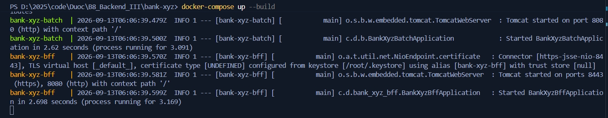

---

### 2. Ejecutar Jobs (batch en puerto 8080)

**Job 1 - Daily Transaction Report**


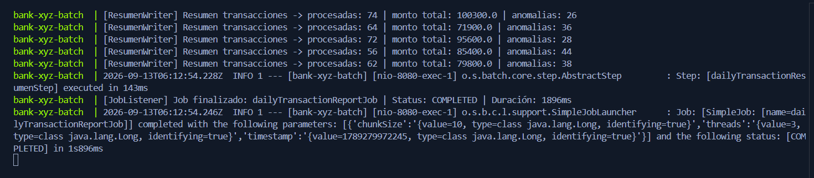

**Job 2 - Monthly Interest**


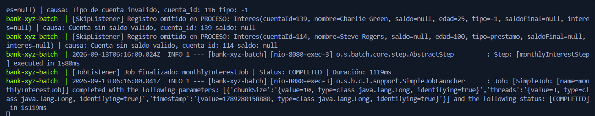

**Job 3 - Annual Statement**


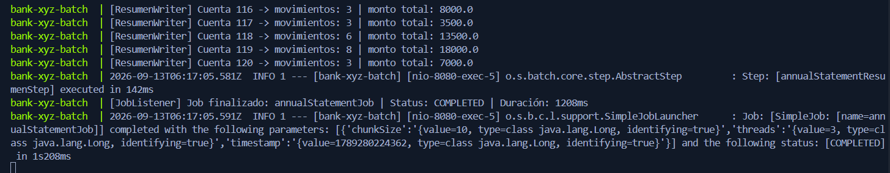

---

### 3. Web BFF (puerto 8443, usuario: web_user)

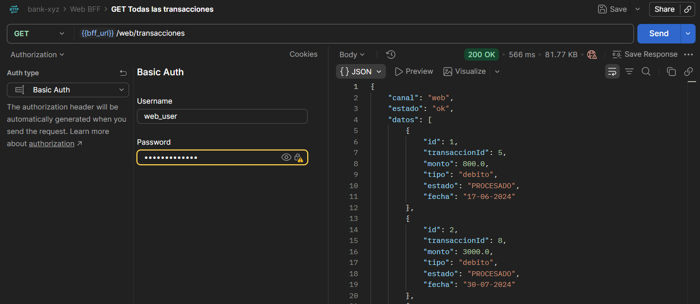
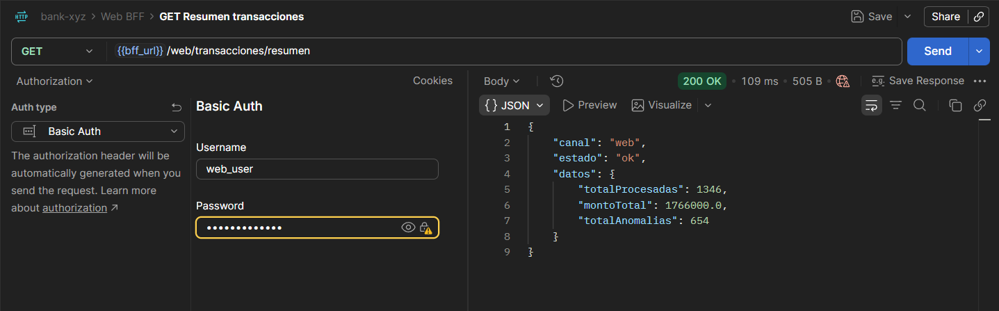

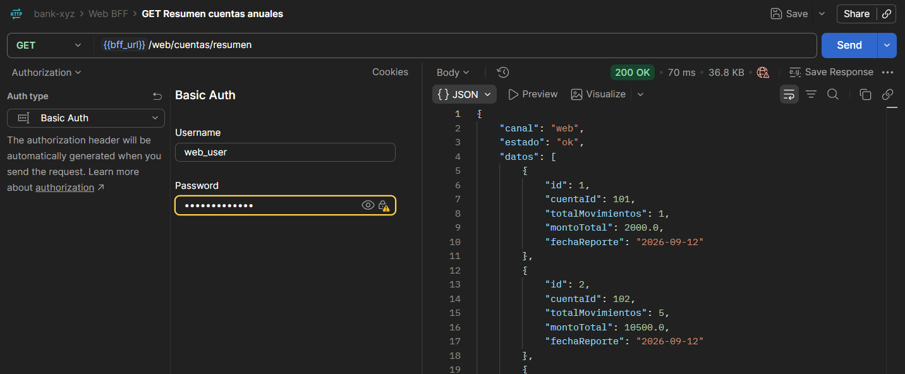
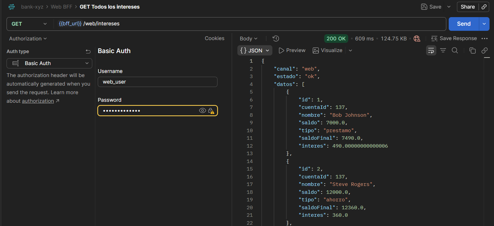

---

### 4. Mobile BFF (puerto 8443, usuario: mobile_user)


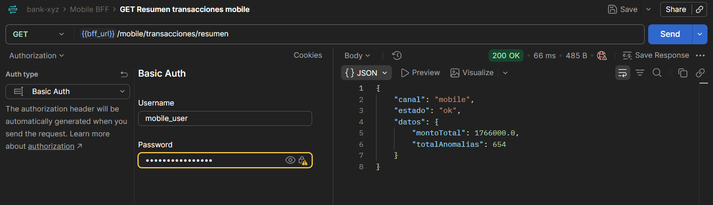


---

### 5. ATM BFF (puerto 8443, usuario: atm_user)


---

### 6. Verificación de seguridad — acceso con rol incorrecto (403)

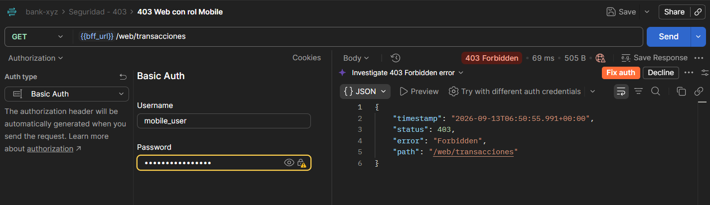
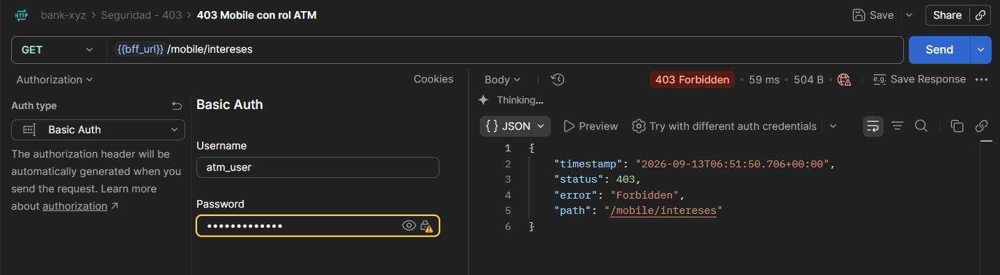
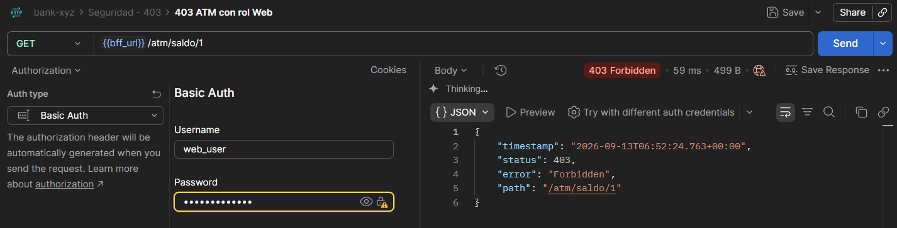

---

### 7. Tests de integración BFF

```bash
cd bank-xyz-bff
./mvnw test
```

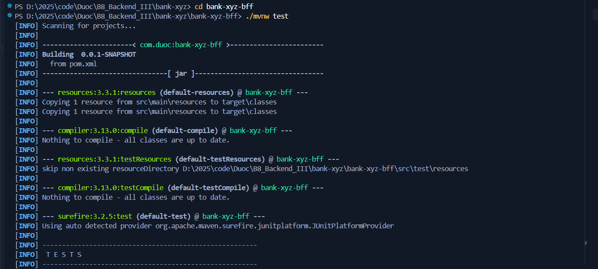
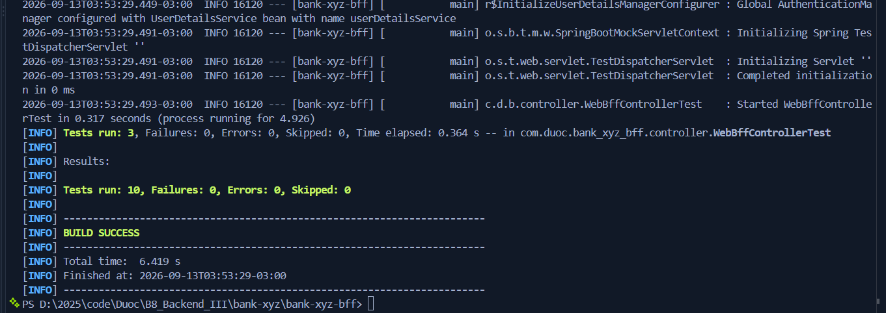
