# Bank XYZ — Microservicios resilientes y seguros en la nube

Arquitectura de microservicios bancarios preparada para un entorno cloud: autenticación y autorización con **OAuth2/JWT**, despliegue con **Docker y Docker Compose**, tolerancia a fallos con **Resilience4j** y comunicación asíncrona con **Apache Kafka** (Patrón Saga con coreografía). Los datos provienen de `bank_legacy_data` y son cargados en MySQL por Spring Batch.

**Objetivos:**

- Proteger el acceso a los microservicios con un servidor de autorización OAuth2 y control por scopes.
- Empaquetar cada servicio en una imagen Docker y orquestarlos con un único `docker-compose.yml`.
- Aplicar patrones de resiliencia (Circuit Breaker, Retry, TimeLimiter, Rate Limiter y fallbacks).
- Mantener la consistencia entre servicios mediante eventos Kafka, con compensación ante fallos.

---

## Descripción

El proyecto implementa una arquitectura orientada a eventos para el Banco XYZ, compuesta por diez servicios independientes:

- **config-server**: configuración centralizada para todos los microservicios.
- **eureka-server**: service discovery donde se registran los microservicios.
- **auth-server**: servidor de autorización OAuth2 que emite tokens JWT.
- **bank-xyz-batch**: jobs de Spring Batch que procesan y persisten datos bancarios en MySQL.
- **mysql**: base de datos relacional que almacena los datos procesados por el batch.
- **zookeeper**: coordinador requerido por Kafka.
- **kafka**: broker de mensajería para la comunicación asíncrona entre microservicios.
- **ms-cuentas**: microservicio de cuentas bancarias — consumer y producer Kafka.
- **ms-transacciones**: microservicio de transacciones — producer principal Kafka.
- **ms-clientes**: microservicio de clientes — consumer final Kafka.

---

## Arquitectura de eventos — Patrón Saga con Coreografía

El sistema implementa el Patrón Saga con Coreografía sobre Apache Kafka. Cada microservicio actúa de forma autónoma, publicando y consumiendo eventos sin un orquestador central.

### Tópicos Kafka

| Tópico | Productor | Consumidor(es) |
|---|---|---|
| `transaccion-registrada` | ms-transacciones | ms-cuentas, ms-clientes |
| `cuenta-actualizada` | ms-cuentas | ms-clientes |
| `notificacion-cliente` | ms-clientes | Sistema externo / log |
| `transaccion-rechazada` | ms-cuentas (fallo) | ms-transacciones (compensación) |

### Flujo feliz (happy path)

```
Cliente → POST /api/transacciones → ms-transacciones
  → publica transaccion-registrada
    → ms-cuentas consume → verifica saldo OK → publica cuenta-actualizada
    → ms-clientes consume transaccion-registrada
    → ms-clientes consume cuenta-actualizada → registra historial
```

### Flujo compensatorio (Saga rollback)

```
ms-cuentas detecta saldo insuficiente
  → publica transaccion-rechazada
    → ms-transacciones consume → actualiza estado → FALLIDA
```

La respuesta HTTP del `POST /api/transacciones` es siempre `PENDIENTE`; el resultado de la Saga se observa en los logs de los microservicios.

---

## Arquitectura general

```
[Config Server :8888]
        ↑ configuración centralizada
[Eureka Server :8761]
        ↑ service discovery
[Auth Server :9000]
        ↑ tokens JWT OAuth2
[MySQL :3306] ← [bank-xyz-batch :8080]
        ↑ datos reales
[ms-cuentas :8081] [ms-transacciones :8082] [ms-clientes :8083]
        ↕ eventos asincrónicos
[Kafka :9092] ← [Zookeeper :2181]
```

---

## Propuesta técnica

| Decisión | Justificación |
|---|---|
| OAuth2 con `client_credentials` y scopes por recurso (`*.read`, `*.write`) | Comunicación entre sistemas sin usuario final; el scope limita lo que puede hacer cada cliente |
| Segundo cliente `bank-xyz-readonly` solo con scopes de lectura | Mínimo privilegio: puede consultar, pero no registrar transacciones |
| Todas las rutas `/api/**` protegidas | Los datos bancarios no se exponen sin token; cada microservicio valida el JWT como Resource Server |
| Credenciales por variables de entorno (`.env`) | Los secretos no quedan fijos en el código ni en el compose |
| Una imagen Docker por servicio | Portabilidad: cada servicio se despliega igual en cualquier entorno |
| Compose con healthchecks y `depends_on: service_healthy` | Orden de arranque garantizado: config → eureka → auth → microservicios |
| `restart: unless-stopped` | Recuperación automática ante la caída de un contenedor |
| Resilience4j sobre las consultas a BD, con fallback | Si MySQL cae, el servicio responde de forma controlada en lugar de quedar esperando 30 s |
| Saga por coreografía en Kafka | Sin orquestador central; cada servicio reacciona a eventos y compensa si falla |

---

## Estructura del repositorio

```
├── auth-server
│   ├── .mvn
│   │   └── wrapper
│   │       └── maven-wrapper.properties
│   ├── src
│   │   ├── main
│   │   │   ├── java
│   │   │   │   └── com
│   │   │   │       └── duoc
│   │   │   │           └── auth_server
│   │   │   │               ├── config
│   │   │   │               │   └── SecurityConfig.java
│   │   │   │               └── AuthServerApplication.java
│   │   │   └── resources
│   │   │       └── application.yaml
│   │   └── test
│   │       └── java
│   │           └── com
│   │               └── duoc
│   │                   └── auth_server
│   │                       └── AuthServerApplicationTests.java
│   ├── .gitattributes
│   ├── .gitignore
│   ├── Dockerfile
│   ├── mvnw
│   ├── mvnw.cmd
│   └── pom.xml
├── bank-xyz-batch
│   ├── .mvn
│   │   └── wrapper
│   │       └── maven-wrapper.properties
│   ├── src
│   │   ├── main
│   │   │   ├── java
│   │   │   │   └── com
│   │   │   │       └── duoc
│   │   │   │           └── bank_xyz_batch
│   │   │   │               ├── config
│   │   │   │               │   ├── AnnualStatementJobConfig.java
│   │   │   │               │   ├── DailyTransactionJobConfig.java
│   │   │   │               │   └── MonthlyInterestJobConfig.java
│   │   │   │               ├── controller
│   │   │   │               │   └── JobController.java
│   │   │   │               ├── exception
│   │   │   │               │   └── InvalidBankDataException.java
│   │   │   │               ├── listener
│   │   │   │               │   ├── BankSkipListener.java
│   │   │   │               │   └── JobCompletionListener.java
│   │   │   │               ├── model
│   │   │   │               │   ├── CuentaAnual.java
│   │   │   │               │   ├── CuentaAnualResumen.java
│   │   │   │               │   ├── Interes.java
│   │   │   │               │   ├── Transaccion.java
│   │   │   │               │   └── TransaccionResumen.java
│   │   │   │               ├── policy
│   │   │   │               │   └── BankSkipPolicy.java
│   │   │   │               ├── processor
│   │   │   │               │   ├── CuentaAnualProcessor.java
│   │   │   │               │   ├── InteresProcessor.java
│   │   │   │               │   └── TransaccionProcessor.java
│   │   │   │               ├── util
│   │   │   │               │   └── DateParser.java
│   │   │   │               ├── writer
│   │   │   │               │   ├── CuentaAnualResumenWriter.java
│   │   │   │               │   └── TransaccionResumenWriter.java
│   │   │   │               └── BankXyzBatchApplication.java
│   │   │   └── resources
│   │   │       ├── application.properties
│   │   │       ├── cuentas_anuales.csv
│   │   │       ├── intereses.csv
│   │   │       ├── schema.sql
│   │   │       └── transacciones.csv
│   │   └── test
│   │       └── java
│   │           └── com
│   │               └── duoc
│   │                   └── bank_xyz_batch
│   │                       └── BankXyzBatchApplicationTests.java
│   ├── .gitattributes
│   ├── .gitignore
│   ├── dockerfile
│   ├── mvnw
│   ├── mvnw.cmd
│   └── pom.xml
├── config-server
│   ├── .mvn
│   │   └── wrapper
│   │       └── maven-wrapper.properties
│   ├── src
│   │   ├── main
│   │   │   ├── java
│   │   │   │   └── com
│   │   │   │       └── duoc
│   │   │   │           └── config_server
│   │   │   │               └── ConfigServerApplication.java
│   │   │   └── resources
│   │   │       ├── config-repo
│   │   │       │   ├── ms-clientes.yaml
│   │   │       │   ├── ms-cuentas.yaml
│   │   │       │   └── ms-transacciones.yaml
│   │   │       └── application.yaml
│   │   └── test
│   │       └── java
│   │           └── com
│   │               └── duoc
│   │                   └── config_server
│   │                       └── ConfigServerApplicationTests.java
│   ├── .gitattributes
│   ├── .gitignore
│   ├── Dockerfile
│   ├── mvnw
│   ├── mvnw.cmd
│   └── pom.xml
├── docs
│   ├── Postman
│   └── images
├── eureka-server
│   ├── .mvn
│   │   └── wrapper
│   │       └── maven-wrapper.properties
│   ├── src
│   │   ├── main
│   │   │   ├── java
│   │   │   │   └── com
│   │   │   │       └── duoc
│   │   │   │           └── eureka_server
│   │   │   │               └── EurekaServerApplication.java
│   │   │   └── resources
│   │   │       └── application.yaml
│   │   └── test
│   │       └── java
│   │           └── com
│   │               └── duoc
│   │                   └── eureka_server
│   │                       └── EurekaServerApplicationTests.java
│   ├── .gitattributes
│   ├── .gitignore
│   ├── Dockerfile
│   ├── mvnw
│   ├── mvnw.cmd
│   └── pom.xml
├── ms-clientes
│   ├── .mvn
│   │   └── wrapper
│   │       └── maven-wrapper.properties
│   ├── src
│   │   ├── main
│   │   │   ├── java
│   │   │   │   └── com
│   │   │   │       └── duoc
│   │   │   │           └── ms_clientes
│   │   │   │               ├── config
│   │   │   │               │   ├── KafkaConfig.java
│   │   │   │               │   ├── RateLimitExceptionHandler.java
│   │   │   │               │   └── SecurityConfig.java
│   │   │   │               ├── controller
│   │   │   │               │   └── ClientesController.java
│   │   │   │               ├── events
│   │   │   │               │   └── TransaccionEvento.java
│   │   │   │               ├── services
│   │   │   │               │   └── ClientesService.java
│   │   │   │               └── MsClientesApplication.java
│   │   │   └── resources
│   │   │       └── application.yaml
│   │   └── test
│   │       └── java
│   │           └── com
│   │               └── duoc
│   │                   └── ms_clientes
│   │                       └── MsClientesApplicationTests.java
│   ├── .gitattributes
│   ├── .gitignore
│   ├── Dockerfile
│   ├── mvnw
│   ├── mvnw.cmd
│   └── pom.xml
├── ms-cuentas
│   ├── .mvn
│   │   └── wrapper
│   │       └── maven-wrapper.properties
│   ├── src
│   │   ├── main
│   │   │   ├── java
│   │   │   │   └── com
│   │   │   │       └── duoc
│   │   │   │           └── ms_cuentas
│   │   │   │               ├── config
│   │   │   │               │   ├── KafkaConfig.java
│   │   │   │               │   ├── RateLimitExceptionHandler.java
│   │   │   │               │   └── SecurityConfig.java
│   │   │   │               ├── controller
│   │   │   │               │   └── CuentasController.java
│   │   │   │               ├── events
│   │   │   │               │   └── TransaccionEvento.java
│   │   │   │               ├── services
│   │   │   │               │   └── CuentasService.java
│   │   │   │               └── MsCuentasApplication.java
│   │   │   └── resources
│   │   │       └── application.yaml
│   │   └── test
│   │       └── java
│   │           └── com
│   │               └── duoc
│   │                   └── ms_cuentas
│   │                       └── MsCuentasApplicationTests.java
│   ├── .gitattributes
│   ├── .gitignore
│   ├── Dockerfile
│   ├── mvnw
│   ├── mvnw.cmd
│   └── pom.xml
├── ms-transacciones
│   ├── .mvn
│   │   └── wrapper
│   │       └── maven-wrapper.properties
│   ├── src
│   │   ├── main
│   │   │   ├── java
│   │   │   │   └── com
│   │   │   │       └── duoc
│   │   │   │           └── ms_transacciones
│   │   │   │               ├── config
│   │   │   │               │   ├── KafkaConfig.java
│   │   │   │               │   ├── RateLimitExceptionHandler.java
│   │   │   │               │   └── SecurityConfig.java
│   │   │   │               ├── controller
│   │   │   │               │   └── TransaccionesController.java
│   │   │   │               ├── events
│   │   │   │               │   └── TransaccionEvento.java
│   │   │   │               ├── services
│   │   │   │               │   └── TransaccionesService.java
│   │   │   │               └── MsTransaccionesApplication.java
│   │   │   └── resources
│   │   │       └── application.yaml
│   │   └── test
│   │       └── java
│   │           └── com
│   │               └── duoc
│   │                   └── ms_transacciones
│   │                       └── MsTransaccionesApplicationTests.java
│   ├── .gitattributes
│   ├── .gitignore
│   ├── Dockerfile
│   ├── mvnw
│   ├── mvnw.cmd
│   └── pom.xml
├── .env.example
├── .gitattributes
├── .gitignore
├── README.md
└── docker-compose.yml
```

---

## Tecnologías

- Java 21
- Spring Boot 3.5.0
- Spring Cloud 2025.0.0
- Spring Kafka 3.3.6 / Apache Kafka 3.9.1
- Spring Security OAuth2 Authorization Server
- Spring Security OAuth2 Resource Server
- Resilience4j (Circuit Breaker, Retry, TimeLimiter, RateLimiter) con Spring Boot AOP
- Netflix Eureka
- Spring Cloud Config
- MySQL 8.0
- Spring Batch
- Docker / Docker Compose

---

## Requisitos previos

- Java 21
- Maven
- Docker Desktop
- Postman

---

## Configuración y ejecución

### Variables de entorno (opcional)

El compose incluye valores por defecto. Solo es necesario crear el `.env` para cambiar credenciales:

```bash
cp .env.example .env
```

| Variable | Valor por defecto | Uso |
|---|---|---|
| `MYSQL_ROOT_PASSWORD` | `root` | Contraseña de MySQL |
| `MYSQL_DATABASE` | `bank_xyz` | Nombre de la base de datos |
| `BANK_CLIENT_SECRET` | `secret123` | Secret del cliente `bank-xyz-client` |
| `BANK_READONLY_SECRET` | `readonly123` | Secret del cliente `bank-xyz-readonly` |
| `ADMIN_PASSWORD` | `admin123` | Contraseña del usuario `admin` del auth-server |

### Compilar todos los proyectos

Los Dockerfile copian el `.jar` generado en `target/`, por lo que se debe compilar antes de construir las imágenes.

```bash
cd config-server
./mvnw clean package -DskipTests
cd ../eureka-server
./mvnw clean package -DskipTests
cd ../auth-server
./mvnw clean package -DskipTests
cd ../bank-xyz-batch
./mvnw clean package -DskipTests
cd ../ms-cuentas
./mvnw clean package -DskipTests
cd ../ms-transacciones
./mvnw clean package -DskipTests
cd ../ms-clientes
./mvnw clean package -DskipTests
cd ..
```

### Levantar todos los servicios

```bash
docker compose up -d --build
docker compose ps
```

Esperar a que config-server, eureka-server, auth-server, mysql y kafka estén `healthy` y a que los tres microservicios aparezcan registrados en Eureka.

### Poblar la base de datos (primer levantamiento o tras `docker compose down -v`)

```bash
POST http://localhost:8080/jobs/daily-transaction
POST http://localhost:8080/jobs/monthly-interest
POST http://localhost:8080/jobs/annual-statement
```

### Pruebas con Postman

Importar `docs/Postman/bank-xyz-s8.postman_collection.json`. Ejecutar la carpeta **1 Tokens** antes de cada grupo de pruebas, ya que los tokens expiran a los 5 minutos.

### Detener los servicios

```bash
docker compose down        # conserva la base de datos
docker compose down -v     # elimina también el volumen de MySQL
```

### Servicios disponibles

| Servicio | URL |
|---|---|
| Config Server | `http://localhost:8888` |
| Eureka Server | `http://localhost:8761` |
| Auth Server | `http://localhost:9000` |
| Batch | `http://localhost:8080` |
| ms-cuentas | `http://localhost:8081` |
| ms-transacciones | `http://localhost:8082` |
| ms-clientes | `http://localhost:8083` |
| Kafka | `localhost:9092` |
| MySQL | `localhost:3306` |

---

## Docker y orquestación

- **Imágenes:** se construyen 7 (config-server, eureka-server, auth-server, bank-xyz-batch, ms-cuentas, ms-transacciones, ms-clientes); MySQL, Zookeeper y Kafka usan imágenes oficiales.
- **Healthchecks:** config-server (`/application/default`), eureka-server (`/`), auth-server (`/oauth2/jwks`), MySQL (`mysqladmin ping`) y Kafka (`kafka-broker-api-versions`).
- **Orden de arranque:** `config-server → eureka-server → auth-server → ms-cuentas / ms-transacciones / ms-clientes`. Los microservicios esperan además a Kafka y MySQL.
- **Reinicio:** `restart: unless-stopped` en todos los servicios.

---

## Autenticación OAuth2

Todas las rutas `/api/**` requieren un token JWT (RS256, duración de 5 minutos) obtenido desde el auth-server con el flujo `client_credentials`.

**Obtener token:**

| Campo | Valor |
|---|---|
| URL | `POST http://localhost:9000/oauth2/token` |
| Auth | Basic Auth |
| grant_type | `client_credentials` |
| scope | Uno de los scopes permitidos para el cliente |

**Clientes registrados:**

| Cliente | Secret por defecto | Scopes permitidos |
|---|---|---|
| `bank-xyz-client` | `secret123` | `cuentas.read`, `cuentas.write`, `clientes.read`, `clientes.write`, `transacciones.read`, `transacciones.write` |
| `bank-xyz-readonly` | `readonly123` | `cuentas.read`, `clientes.read`, `transacciones.read` |

**Respuestas de seguridad:**

| Código | Situación |
|---|---|
| 401 | Petición sin token, o token inválido o vencido |
| 403 | Token válido, pero sin el scope requerido por el endpoint |
| 400 `invalid_scope` | El cliente solicita un scope que no tiene asignado |

---

## Endpoints disponibles

### bank-xyz-batch (puerto 8080)

| Endpoint | Método | Descripción |
|---|---|---|
| `/jobs/daily-transaction` | POST | Ejecuta job de transacciones diarias |
| `/jobs/monthly-interest` | POST | Ejecuta job de intereses mensuales |
| `/jobs/annual-statement` | POST | Ejecuta job de estados de cuenta anuales |

### ms-transacciones (puerto 8082)

| Endpoint | Método | Acceso | Descripción |
|---|---|---|---|
| `/api/transacciones` | GET | JWT `transacciones.read` | Lista transacciones desde BD |
| `/api/transacciones` | POST | JWT `transacciones.write` | Registra transacción y publica evento Kafka |
| `/api/transacciones/info` | GET | JWT `transacciones.read` | Info del microservicio |
| `/api/transacciones/resilience` | GET | JWT `transacciones.read` | Circuit Breaker + Retry + TimeLimiter |
| `/api/transacciones/ratelimit` | GET | JWT `transacciones.read` | Rate Limiter |

### ms-cuentas (puerto 8081)

| Endpoint | Método | Acceso | Descripción |
|---|---|---|---|
| `/api/cuentas` | GET | JWT `cuentas.read` | Lista cuentas anuales desde BD |
| `/api/cuentas/intereses` | GET | JWT `cuentas.read` | Lista intereses desde BD |
| `/api/cuentas/resumen` | GET | JWT `cuentas.read` | Resumen de cuentas desde BD |
| `/api/cuentas/resilience` | GET | JWT `cuentas.read` | Circuit Breaker + Retry + TimeLimiter |
| `/api/cuentas/ratelimit` | GET | JWT `cuentas.read` | Rate Limiter |

### ms-clientes (puerto 8083)

| Endpoint | Método | Acceso | Descripción |
|---|---|---|---|
| `/api/clientes` | GET | JWT `clientes.read` | Lista clientes desde BD |
| `/api/clientes/intereses` | GET | JWT `clientes.read` | Lista intereses por cliente desde BD |
| `/api/clientes/resilience` | GET | JWT `clientes.read` | Circuit Breaker + Retry + TimeLimiter |
| `/api/clientes/ratelimit` | GET | JWT `clientes.read` | Rate Limiter |

---

## Resilience4j — Patrones implementados

| Patrón | Configuración |
|---|---|
| Circuit Breaker | Ventana de 10 llamadas (mínimo 5); se abre con 50% de fallos; 10 s en estado OPEN; 3 llamadas de prueba en HALF_OPEN |
| Retry | 3 intentos con backoff exponencial (x2) desde 1 s; no reintenta `CallNotPermittedException` |
| Time Limiter | Timeout de 2 segundos por intento |
| Rate Limiter | Máximo 5 llamadas cada 10 segundos; el exceso responde **429** (`RateLimitExceptionHandler`) |
| Fallback | Respuesta controlada `{"error":"Servicio no disponible","detalle":...}` |

Notas de implementación:

- Las anotaciones de Resilience4j requieren `spring-boot-starter-aop`; sin esa dependencia Spring las ignora silenciosamente.
- El `fallbackMethod` se declara en `@Retry` (la capa más externa). Si estuviera en `@CircuitBreaker`, el fallback ocultaría el error y el Retry nunca reintentaría.

---

## Evidencia de ejecución

### 1. Contenedores levantados con Docker Compose

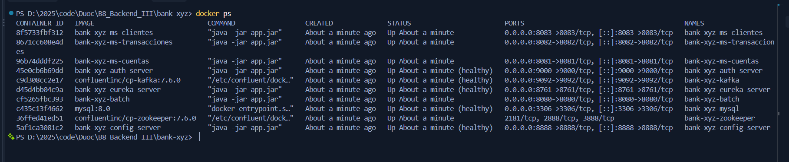

---

### 2. Eureka — 3 microservicios registrados

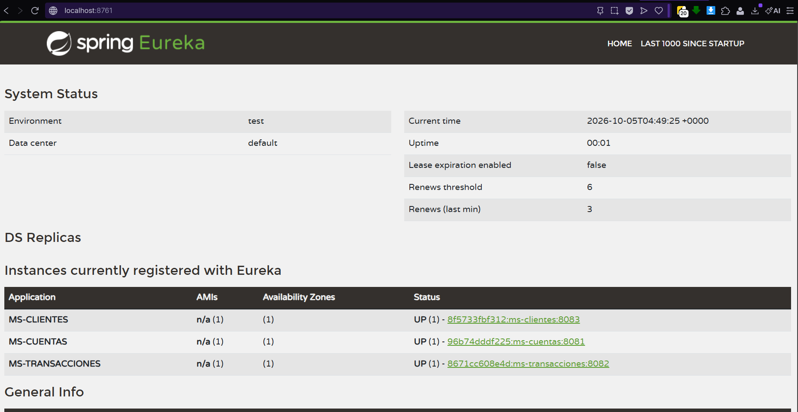

---

### 3. Obtención de tokens JWT

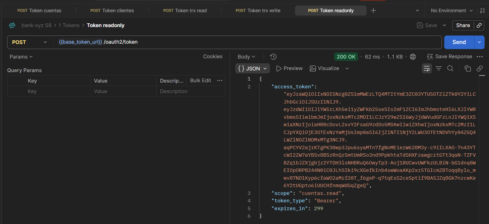

---

### 4. Seguridad OAuth2 — 401, 403 e `invalid_scope`

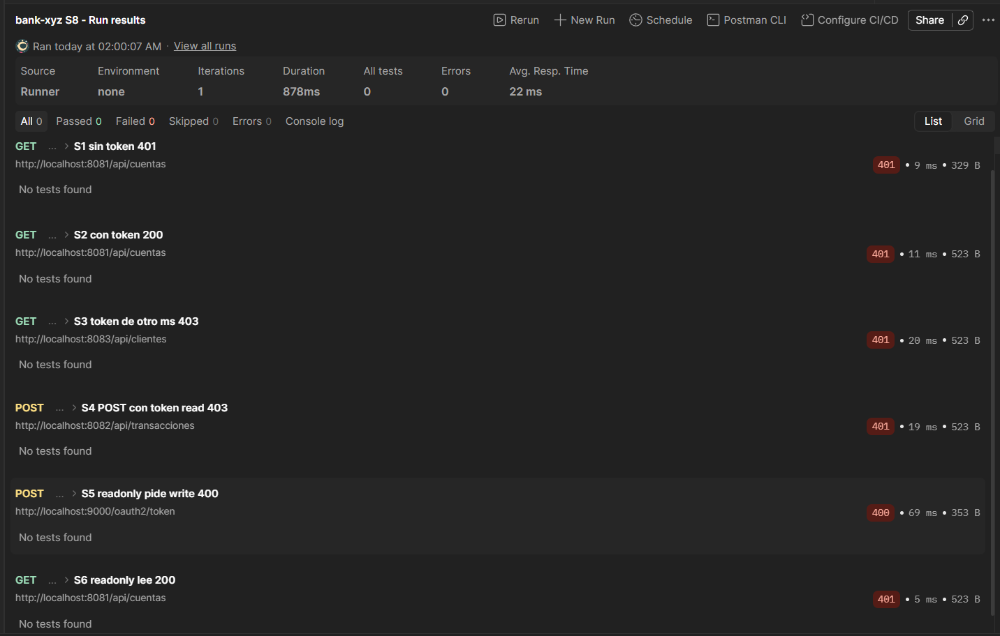
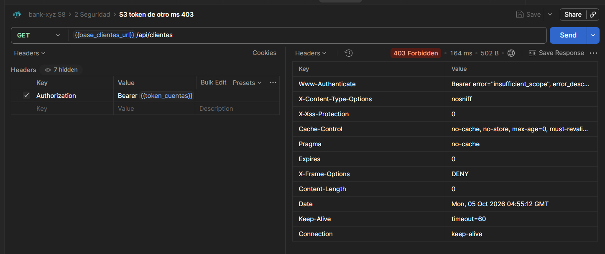

---

### 5. Resilience4j — Rate Limiter

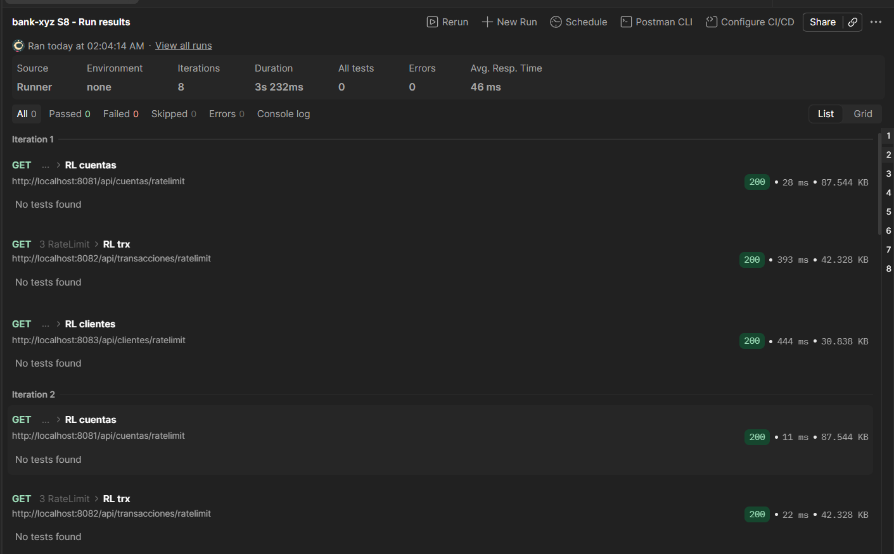
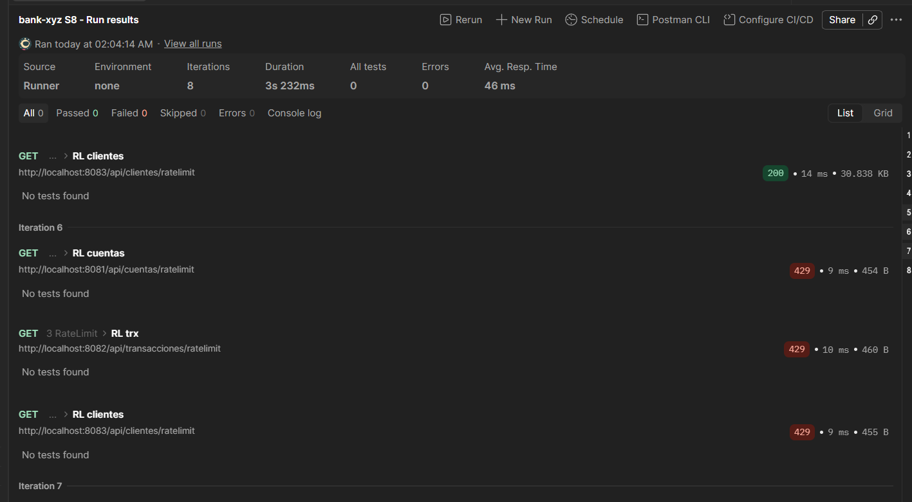

---

### 6. Resilience4j — Circuit Breaker, Retry, TimeLimiter y Fallback

**Funcionamiento normal:**

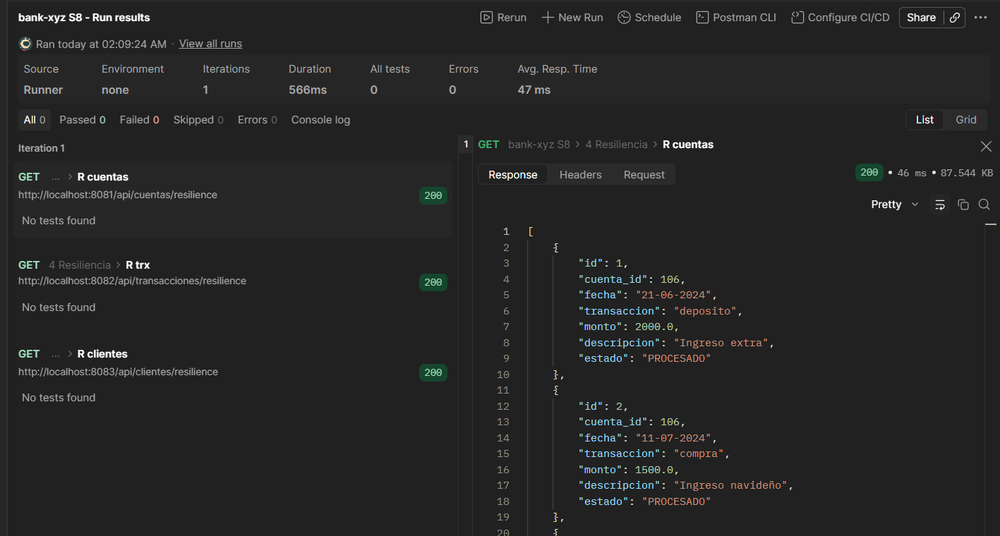

**Con MySQL detenido:**

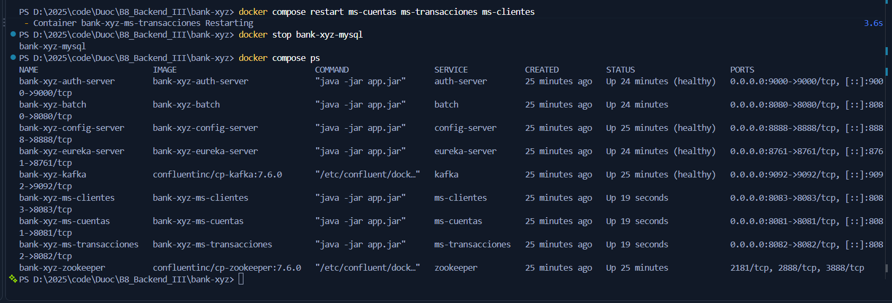
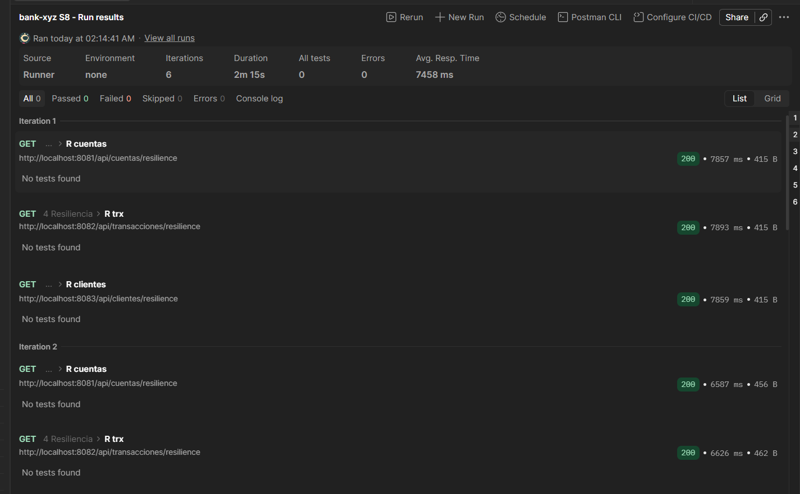
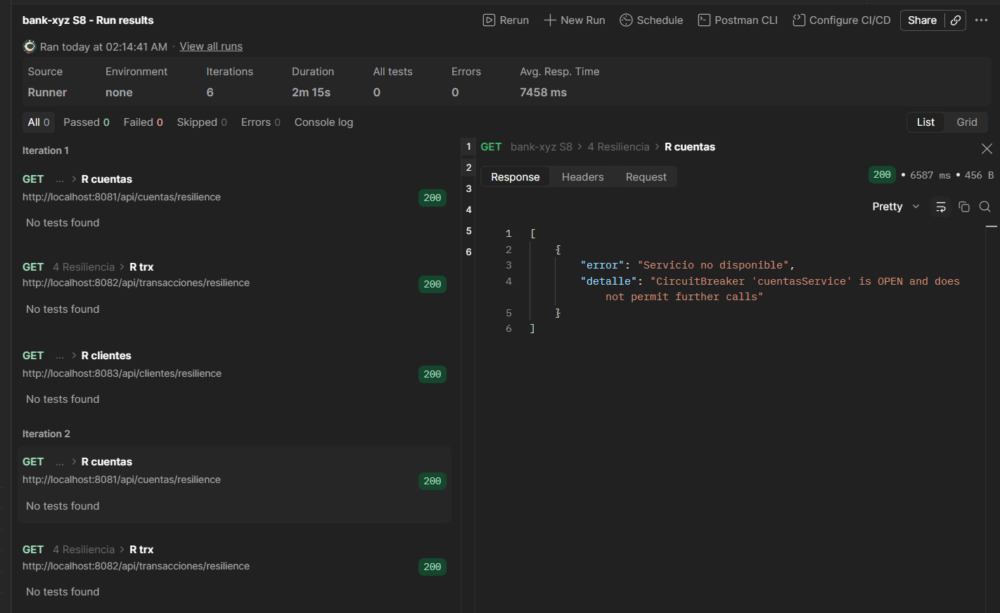

**Recuperación al levantar MySQL:**

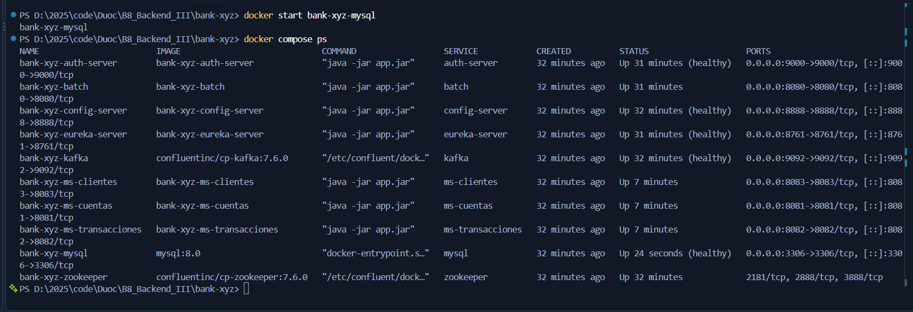

---

### 7. Flujo Kafka — happy path

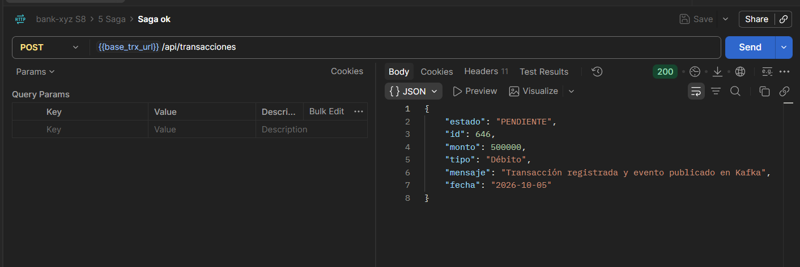
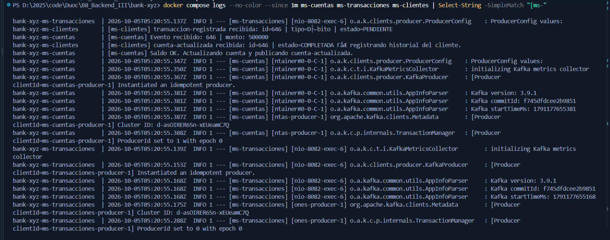

---

### 8. Flujo Kafka — compensación Saga

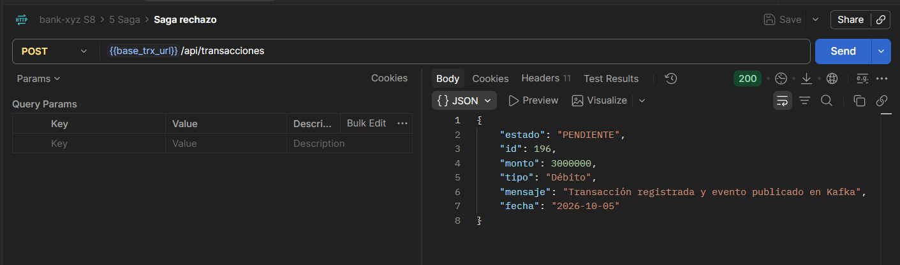
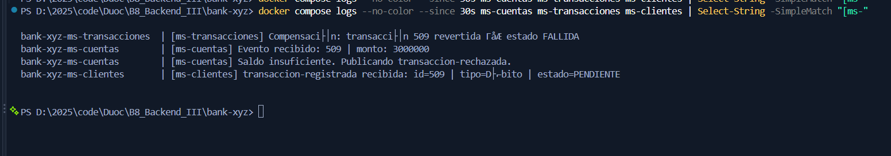
