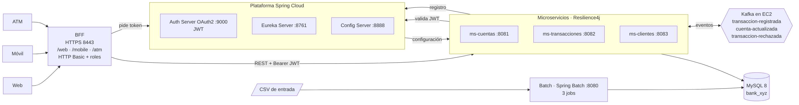
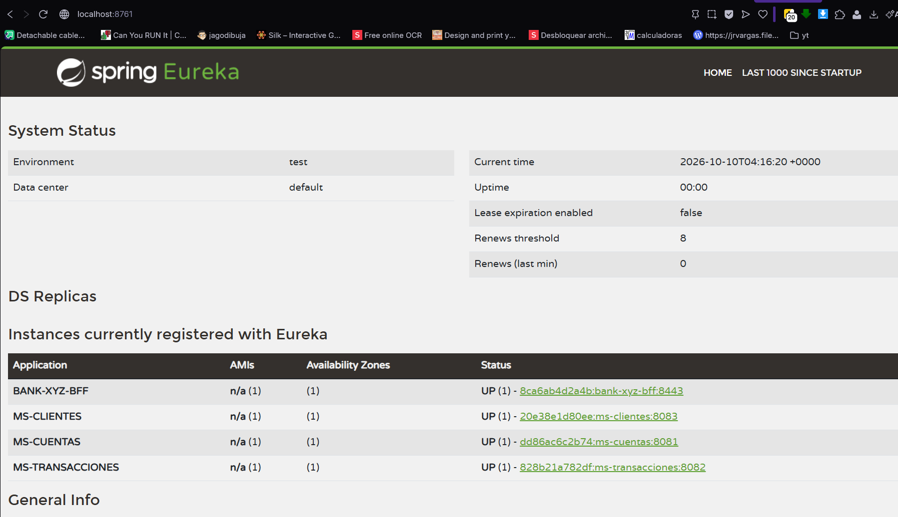
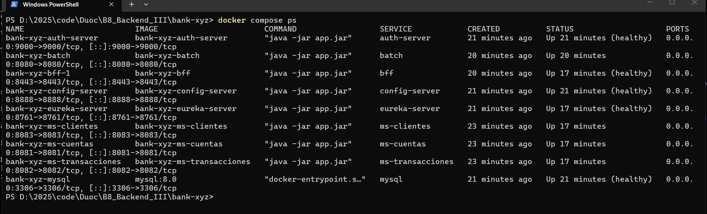
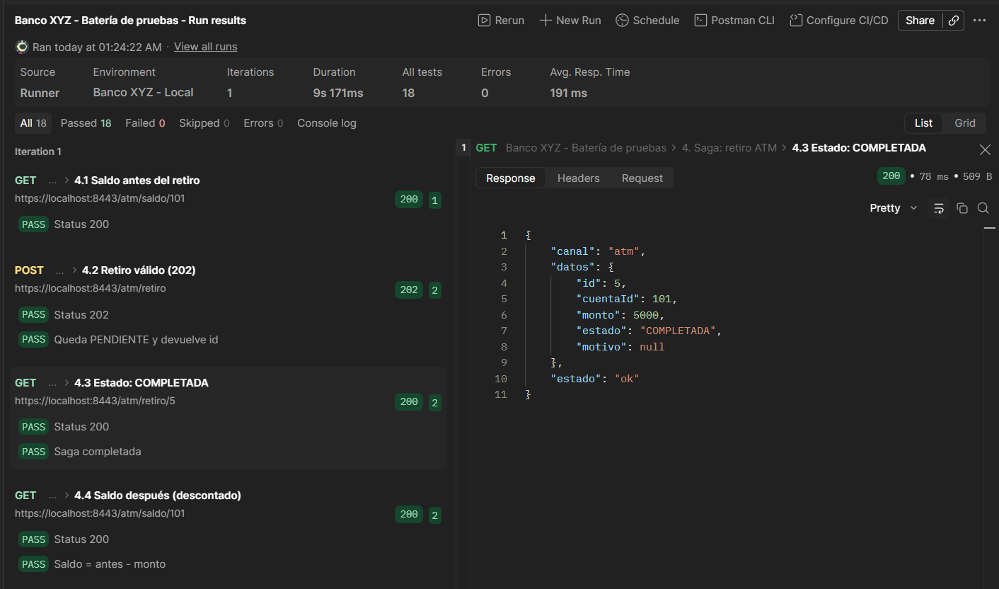

# Banco XYZ – Modernización Backend con Spring Cloud y Spring Batch

Migración del sistema legacy del Banco XYZ (COBOL + scripts Shell) a una arquitectura de microservicios: procesos batch en Spring Batch, tres BFF por canal (web, móvil y cajero), microservicios resilientes y seguros, mensajería asíncrona con Kafka y orquestación con Docker Compose.

## Arquitectura



| Módulo | Puerto | Responsabilidad |
|---|---|---|
| `config-server` | 8888 | Configuración centralizada (Spring Cloud Config) |
| `eureka-server` | 8761 | Descubrimiento de servicios |
| `auth-server` | 9000 | Servidor OAuth2 (client_credentials, JWT, scopes) |
| `ms-cuentas` | 8081 | Gestión de cuentas: saldos reales, intereses y estados anuales |
| `ms-transacciones` | 8082 | Procesamiento de pagos: depósitos, retiros y pagos; inicia y cierra la Saga |
| `ms-clientes` | 8083 | Gestión de clientes: consume eventos del flujo transaccional |
| `bank-xyz-bff` | 8443 (HTTPS) | BFF con tres canales: `/web`, `/mobile`, `/atm` |
| `bank-xyz-batch` | 8080 | Tres jobs Spring Batch: transacciones diarias, intereses mensuales y estados anuales |
| `mysql` · `kafka` · `zookeeper` | 3306 · 9092 · 2181 | Persistencia y mensajería |

Los microservicios se registran en Eureka y se comunican con balanceo de carga del lado del cliente. Los eventos de negocio viajan por Kafka (`transaccion-registrada`, `cuenta-actualizada`, `transaccion-rechazada`).



## Tecnologías

Java 21 · Spring Boot 3.5 / 3.3 (batch) · Spring Cloud 2025.0 · Spring Batch 5 · Spring Security + OAuth2 · Resilience4j · Apache Kafka · MySQL 8 · Docker y Docker Compose · Actuator.

## Estructura del repositorio

```
├── auth-server
├── bank-xyz-batch
├── bank-xyz-bff
├── config-server
├── deploy
│   └── kafka-ec2
├── docs
│   ├── Postman
│   └── evidencias
├── eureka-server
├── ms-clientes
├── ms-cuentas
├── ms-transacciones
├── .env.example
├── .gitattributes
├── .gitignore
├── README.md
├── despliegue.md
├── docker-compose.yml
└── instrucciones.md
```

## Qué incluye cada parte

- **Batch:** tres jobs con procesamiento multi-hilo parametrizable, tolerancia a registros inválidos, resúmenes idempotentes y reintento automático de la ejecución completa.
- **BFF:** un módulo con tres canales independientes, cada uno con su rol, su autenticación y su formato de respuesta (completo, reducido o mínimo), todo sobre HTTPS.
- **Microservicios:** seguridad OAuth2 con scopes, resiliencia (circuit breaker, retry, time limiter y rate limiter) y una Saga coreografiada por Kafka con estado persistido y saldo real.
- **Despliegue:** todo corre en Docker Compose, con una arquitectura preparada para escalar horizontalmente. Solo Kafka se aloja en una instancia EC2.

El detalle técnico y las decisiones de diseño están en el **informe técnico** (`EFT_S9_MiguelVargas.pdf`).



## Inicio rápido

```bash
cp .env.example .env
docker compose up -d --build
```

Los pasos completos, las credenciales por canal y las pruebas de cada componente están en **[`instrucciones.md`](instrucciones.md)**.
El despliegue de Kafka en AWS está en **[`despliegue.md`](despliegue.md)**.



## Documentación

| Documento | Contenido |
|---|---|
| `EFT_S9_MiguelVargas.pdf` | Procesos clave, arquitectura, requerimientos de negocio, diagramas, implementación, desafío y mejoras |
| [`instrucciones.md`](instrucciones.md) | Cómo ejecutar y probar cada componente |
| [`despliegue.md`](despliegue.md) | Despliegue de Kafka en EC2 y conexión con los microservicios |
| [`docs/Postman/`](docs/Postman/) | Colección y environment con la batería de pruebas de todos los componentes |

## Datos de origen

Los archivos de entrada del batch provienen de [fin_legacy_data](https://github.com/KariVillagran/fin_legacy_data).
