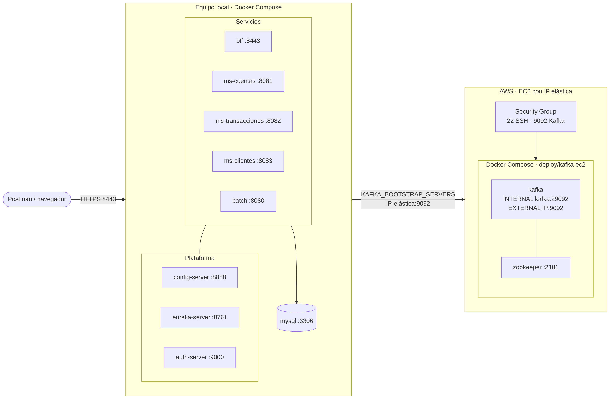
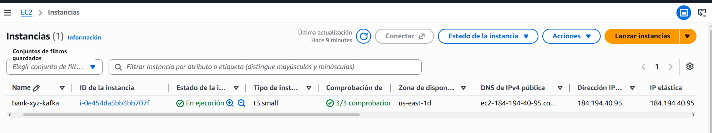
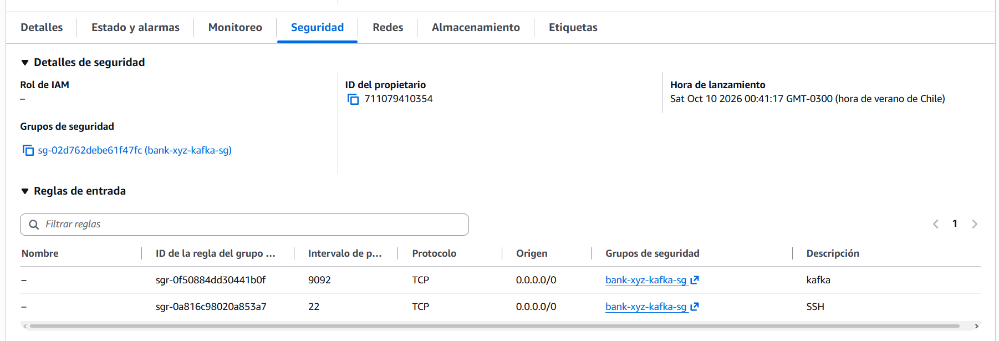
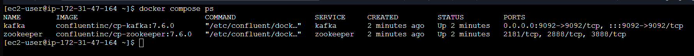
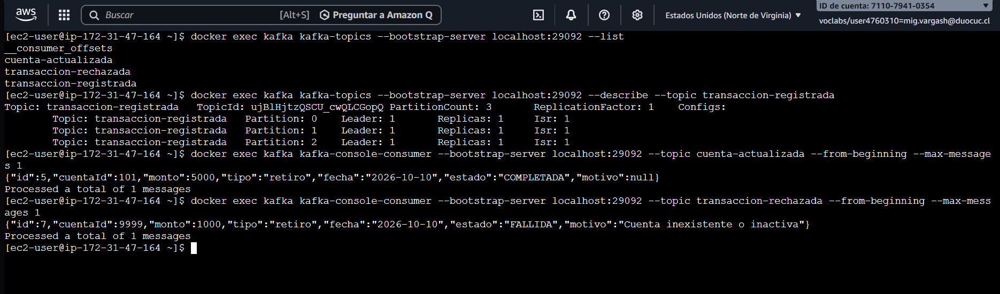
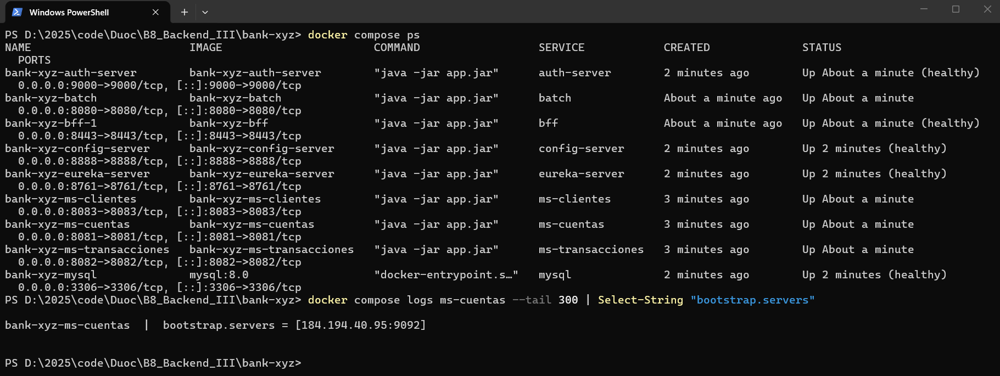

# Despliegue de Kafka en AWS (EC2)

Alcance: **solo Kafka** (con Zookeeper) corre en una instancia EC2. El resto del sistema (microservicios, BFF, batch, MySQL, Eureka, Config y Auth) permanece en Docker local y se conecta a este Kafka mediante la variable `KAFKA_BOOTSTRAP_SERVERS`. La ejecución local se explica en [`instrucciones.md`](instrucciones.md) y el diseño completo en el informe técnico.



## 1. Requisitos

- Cuenta de AWS con permiso para EC2.
- Un key pair (`.pem`) para conectarte por SSH.
- Docker Desktop local con el sistema ya funcionando (ver `instrucciones.md`).

## 2. Crear la instancia

| Parámetro | Valor |
|---|---|
| AMI | Amazon Linux 2023 |
| Tipo | `t3.small` (2 GB RAM mínimo para Kafka + Zookeeper) |
| Almacenamiento | 20 GB gp3 |
| Key pair | El `.pem` creado para este proyecto |



## 3. Red y seguridad

**Security Group** con estas reglas de entrada:

| Tipo | Puerto | Origen |
|---|---|---|
| SSH | 22 | Mi IP |
| TCP personalizado | 9092 | `0.0.0.0/0` (solo para la demostración) |

> **Nota:** Kafka queda sin autenticación (PLAINTEXT). Abrir el 9092 a `0.0.0.0/0` es aceptable únicamente durante la demostración. En un uso real se limita a la IP de quien se conecta, o se agrega TLS y autenticación. Al terminar, se detiene la instancia.



**Elastic IP:** se asocia una Elastic IP a la instancia para que la dirección no cambie al detenerla. Se libera al terminar, porque una Elastic IP sin instancia asociada genera cobro.

## 4. Instalar Docker en la EC2

```bash
ssh -i mi-llave.pem ec2-user@<EC2_IP>

sudo dnf install -y docker
sudo systemctl enable --now docker
sudo usermod -aG docker ec2-user
sudo mkdir -p /usr/local/lib/docker/cli-plugins
sudo curl -SL https://github.com/docker/compose/releases/download/v2.29.7/docker-compose-linux-x86_64 \
  -o /usr/local/lib/docker/cli-plugins/docker-compose
sudo chmod +x /usr/local/lib/docker/cli-plugins/docker-compose
exit
```

Vuelve a conectarte por SSH para que se aplique el grupo `docker`.

## 5. Levantar Kafka

Desde tu equipo, copia el compose del repositorio:

```bash
scp -i mi-llave.pem deploy/kafka-ec2/docker-compose.yml ec2-user@<EC2_IP>:~/docker-compose.yml
```

En la EC2, define la IP pública en un archivo `.env` junto al compose (Docker Compose lo lee solo):

```bash
echo "EC2_PUBLIC_IP=<EC2_IP>" > .env
docker compose up -d
docker compose ps
```

Puntos clave del `docker-compose.yml` de `deploy/kafka-ec2/`:

- Dos listeners: `INTERNAL` (`kafka:29092`) para el tráfico entre contenedores y `EXTERNAL` (`<EC2_IP>:9092`) para los clientes remotos.
- `KAFKA_ADVERTISED_LISTENERS` usa la IP pública. Con `kafka:9092` los clientes conectan, pero fallan al consumir.
- `KAFKA_NUM_PARTITIONS: 3` y creación automática de tópicos.
- Memoria acotada (`-Xmx512m`) para la instancia pequeña.



## 6. Conectar los microservicios locales

En el `.env` de la raíz del repositorio:

```
KAFKA_BOOTSTRAP_SERVERS=<EC2_IP>:9092
```

Recrea los servicios que usan Kafka:

```bash
docker compose up -d --no-deps --force-recreate ms-cuentas ms-transacciones ms-clientes
```

`--no-deps` evita que Compose levante el Kafka local, ya que los servicios usan el de la EC2.

El `docker-compose.yml` lee la variable en `SPRING_KAFKA_BOOTSTRAP_SERVERS: ${KAFKA_BOOTSTRAP_SERVERS:-kafka:9092}`. Si no está definida, se usa el Kafka local.

## 7. Verificación

1. Ejecuta un retiro de prueba (comando en `instrucciones.md`, sección de la Saga).
2. En la EC2, comprueba los tópicos y los mensajes:

```bash
docker exec kafka kafka-topics --bootstrap-server localhost:29092 --list
docker exec kafka kafka-console-consumer --bootstrap-server localhost:29092 \
  --topic cuenta-actualizada --from-beginning --max-messages 3
```



3. Confirma que el saldo cambió y que la transacción quedó `COMPLETADA`.



## 8. Problemas frecuentes

| Síntoma | Causa probable | Solución |
|---|---|---|
| Timeout al conectar | Tu IP pública cambió | Actualiza la regla del puerto 9092 |
| Conecta pero no consume | `EC2_PUBLIC_IP` no estaba definida en el `.env` de la EC2 al levantar Kafka | `docker compose down`, corregir el `.env` y volver a levantar |
| Puerto cerrado | Security Group sin la regla 9092 | `Test-NetConnection <EC2_IP> -Port 9092` y revisar el grupo |
| Dejó de funcionar tras reiniciar | La IP pública cambió (sin Elastic IP) | Actualizar EC2_PUBLIC_IP en el .env de la EC2 y KAFKA_BOOTSTRAP_SERVERS en el .env local |

## 9. Costos y limpieza

Detén la instancia cuando no la uses. Al terminar la evaluación, termina la instancia y libera la Elastic IP para evitar cargos.